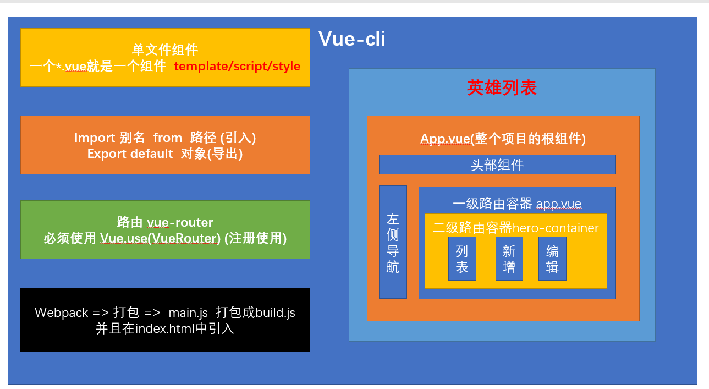
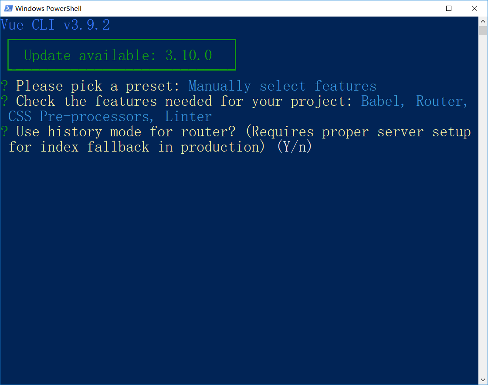
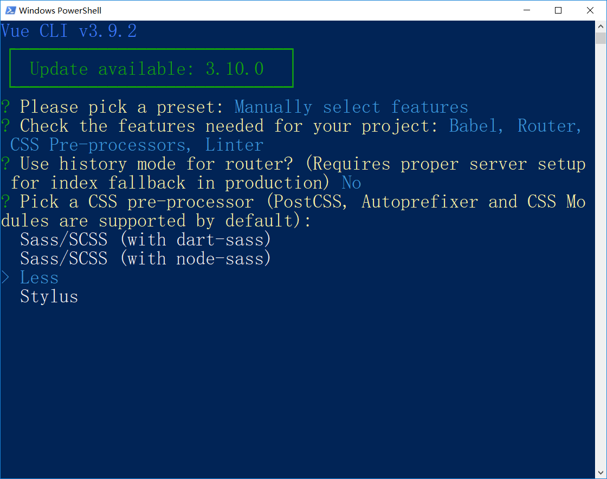
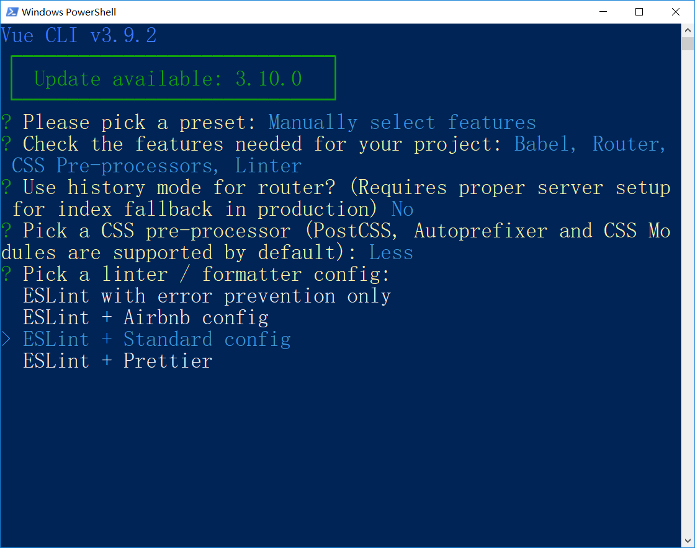
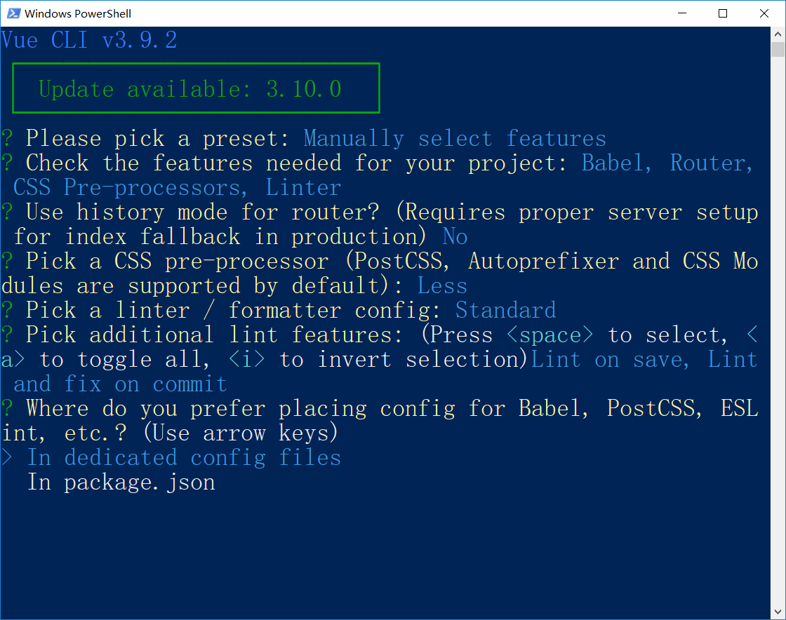
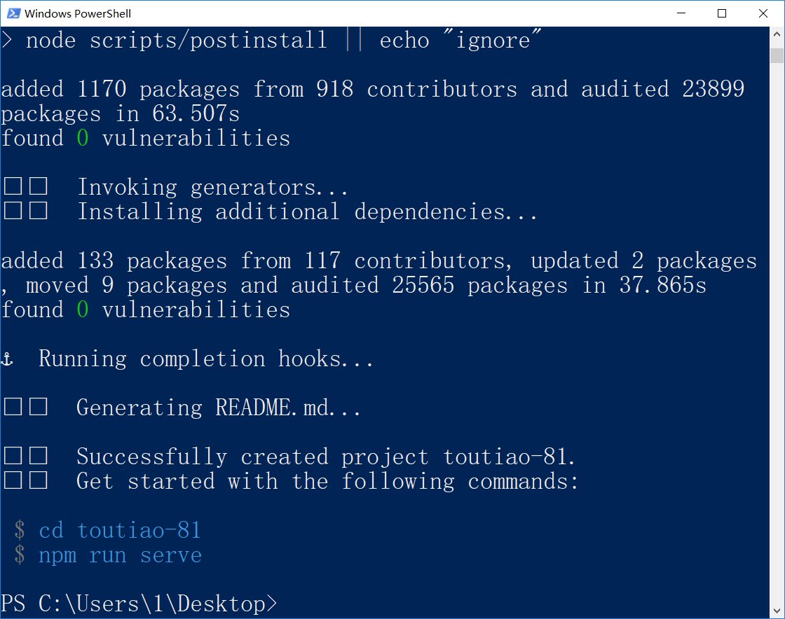
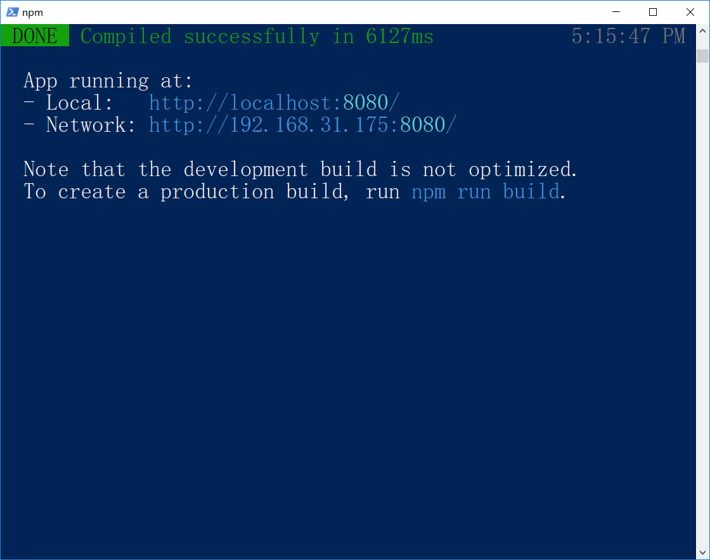

# 黑马头条PC第1天

## 反馈

| ***  | 蒙圈了 还是理不清组件 路由那块的 调用 理不清哪往哪调         |
| ---- | ------------------------------------------------------------ |
| ***  | 老师 能不能讲的稍微慢点啊 大脑的运转跟不上你的手速           |
| ***  | 唉，练吧                                                     |
| ***  | 老师，梳理一下各个文件之间的串联关系吧，有点不知道什么在main.js中写，什么在app.vue中写； |
| ***  | 代码部分可以多写一点备注                                     |
| ***  | 之前学组件和路由还没有彻底的熟练啊，今天就频繁的使用，有点懵 |
| ***  | 上午:emmmmmm...真简单 ....... 下午:?????????????这上午讲过吗????????? |
| ***  | 路由嵌套听得真的很迷，再就是编辑那一部分还理解的不是很清楚！！ |
| ***  | 今天真的是感觉吃了一斤的懵逼果                               |
| ***  | 准备工作第一次做，有点吼不住，后面又被来回切换文件给整蒙蔽了 ，不过嵌套倒是清楚 |
| ***  | 老师 我难受啊 我太难了 我特别想都会 但是我的脑细胞不允许我这么做啊 跪求老师帮我一下 |
| ***  | 路由嵌套，组件嵌套，嵌套，嵌套，嵌套，嵌套！！！awsl         |
| ***  | 全选D就对了                                                  |
| ***  | 由于某种不可抗力 听课失败 完全跟不上节奏了........... a w s l |
| ***  | 问题一 为什么app.vue和router.js接收的地址要分来写,怎么联系到一起的 问题二 list容器是怎么链接到app.vue并体现到页面上的,通过什么连接的 <router-view></router-view> // 加入承载视图 |
| ***  | 就是不太明白                                                 |



## 复习

* 一个*.vue文件就是一个组件  =>单文件组件 

* 路由 => 地址发生变化  => 切换组件 =>   地址  =>组件  path ,component

* 真正的项目 =>文件尽可能分散 => 每个文件都有独立的功能 => 方便维护

* main.js  => 入口 =>  所有的内容都从这里开始  =>  import   其他组件 =>  import  => import 

* App.vue => 整个项目的根组件 

* router.js => 专门配置路由的

* 路由级组件  => 直接挂在地址上的组件就叫做路由组件  path: component =>views

* 普通组件  =>  <child-a> => 普通组件 => components

* 主动思考 => 程序员必备

* router-view  一级路由容器  =>  一级路由 =>  path :component(一级路由组件) =>  router-view(二级路由容器) => path: component(二级路由组件)

  

## 黑马头条PC-我们要做什么?

**`目标`**对于黑马头条的项目进行演示及介绍

* 一个类似于[今日头条自媒体头条号](<http://mp.toutiao.com/profile_v3/index>)的后台管理系统。
* SPA应用
* [黑马头条PC线上地址](http://ttmp.research.itcast.cn/#/login)
* 演示项目效果

## 黑马头条PC-项目账号怎么来?

**`目标`** 如何拥有一个黑马头条的账号

* [黑马头条客户端地址](http://toutiao.research.itcast.cn/#/login)
* 你需要在这个地址上输入自己的**手机号** **验证码(246810)** 
* 以上操作便完成了注册操作 
* 再回到PC页面 使用 刚才注册用的**手机号**和**验证码(246810)**即可完成登录
* 13911111111(系统账号)
* 246810

**`任务`**注册一个自己的黑马头条账号,并浏览相关页面

## 黑马头条PC-我们用什么技术做?

**`目标`** 了解 在黑马头条项目中需要应用的技术

- [Vue.js](<https://cn.vuejs.org/>)   ==>> MVVM框架
- [Vue Router](<https://router.vuejs.org/>)  ==> 实现Vue项目的前端路由功能
- [Vue CLI](<https://cli.vuejs.org/>)   ==> Vue项目的脚手架工具3.0
- [Vuex](<https://vuex.vuejs.org/zh/>) ==> 状态共享框架(**`略难理解`**,根据情况) => PC项目不做 =>移动端Vuex
- eventBus ==> **`Vuex的替代方案`**(根据课程吸收情况) 子组件 => 父组件 $emit()
- [axios](<https://github.com/axios/axios>)  ==> 请求工具 (拦截请求)
- [ElementUI](<https://element.eleme.io/>)  ==> Vue前端UI框架 (**`极其重要`**的知识点  工作几乎每天都用)
- [Echarts](<https://echarts.baidu.com/>) ==> 第三方图表插件 (强大的图表插件 可在Vue中集成) 百度出品
- [nprogress](<https://github.com/rstacruz/nprogress>)  ==>  第三方进度条(用来美化前端的页面跳转)
- [Quill](<https://github.com/quilljs/quill>) ==> Vue第三方插件(富文本编辑器)
- [Eslint](https://cn.eslint.org/docs/user-guide/getting-started)  ==> 语法校验辅助工具(它的目标是保证**`代码的一致性`**和**`避免错误`**)


* 结论
* 需要重点掌握 通过**`vue-cli4.0`**初始化项目
* 使用**`vue-router`**配置前端路由
* 使用**`aixos`**进行数据请求
* 重点掌握 **`ElementUI`**在项目中的应用

**`任务`**查阅以上各个技术的官网文档,对各个技术有个初步了解


## 黑马头条PC-知识补充-Vue的插槽-默认插槽(匿名)

* **`目标`**掌握什么是插槽, 并且学会使用默认插槽 

* 什么是插槽？

* 我们以前在学习组件的时候 如果要使用一个组件 只需要这样写

  ```xml
  <child></child>   // 使用了一个组件
  ```

  这个组件 的模板内容(template)可能是这样的 

  ```xml
  <div>Hello World</div>
  ```

  我们发现 使用组件时 使用的是标签 标签内部可不可以写一些东西呢

  ```xml
  <child>张三</child>
  ```

  我们在组件标签上写入了一个张三 那么这个张三能显示吗? 答案显示是**`否定`**的 有没有什么办法能够让张三显示?  这个时候我们要用到一个叫做**`插槽`**的概念   我们可以在定义组件的模板中 用到一个**`slot(插槽)`**标签来接收传入的模板内容 如 

  ```xml
  <div>Hello World <slot></slot></div>
  ```

  效果立刻就会出来 

  

  那么 放**`多个插槽`**可不可以?

  ```xml
  <div><slot></slot>Hello World <slot></slot></div>
  ```

  

同样的,不管放置多少个**`slot`**,**放置slot的位置**都会将 我们组件标签内部的结构**`替换`**

那么如果child标签里放置的又是多个标签呢?

```xml
<child>
    <p>hi 我是插槽的内容1</p>
    <p>hi 我是插槽的内容2</p>
    <p>hi 我是插槽的内容3</p>
    <p>hi 我是插槽的内容4</p>
    <p>hi 我是插槽的内容5</p>
</child>
```

我们在child标签中放置了多个p标签 来看下效果


发现了吗? 不论放置多少个标签,都会完成**`slot标签的内容`**替换 **`传入的内容`**

以上这种我们在子组件中用**`slot占据位置`**,在父组件中 传入替换内容的方式 就是**`插槽`**

* **`有几个slot标签就有几个坑`**
* 组件标签传入的内容 会把每个坑填满

**`任务`**

1. 定义一个组件 里面静态内容为 
2. * 第一行   我来到学习前端技术
   * 第二行   在有很多可爱的同学
   * 第三行   希望离开时我们能一起吃个饭
3. 使用插槽技术 实现 显示的内容为
   - 第一行   我来到**`黑马`**学习前端技术
   - 第二行   在**`黑马`**有很多可爱的同学
   - 第三行   希望离开**`黑马`**时我们能一起吃个饭

## 黑马头条PC-知识补充-Vue的插槽-后备内容

- **`目标`**掌握插槽的后备内容的使用方式

- 上个小节中,我们学习了**`slot(插槽)`**最基本的使用方式,如果我们在**`组件中定义了插槽`**,就**必须传入内容**,否则组件插槽的位置就会什么都没有. 这样一来,如果 我们有七个组件用的是一个内容,只有第八个组件用的是另一个内容,那么**`同样的插槽内容要写多次`**,这样很傻,也不爽,有没有解决方案?

- **`当然有`**!!  我们可以在定义插槽时,在**`slot(标签)`**中写入**`默认内容`**   如果在传入插槽内容时,内容不为空,那么还会**`按照之前的模式替换`**,如果没传,那么**`默认内容`**就会自动出现**`替换slot`**的位置

- ```xml
  <div>
      Hello world 
      <slot>我是默认的哦</slot>
  </div>
  ```

- 使用组件

- ```xml
  <child></child>  // 什么都不写 页面上就会显示 Hello World 我是默认的哦
  <child>我是新的</child> // 写了内容 页面上就会显示 Hello World 我是新的
  ```

- 如果组件中定义了**`多个slot`**那么有内容部分就显示内容 没内容部分为空

- ```xml
  <div>
      <slot></slot>
      Hello world 
      <slot>我是默认的哦</slot>
  </div>
  // 在使用该组件内容时 如果不传入任何内容  页面上就会显示 Hello World 我是默认的哦
  ```

- **`任务`**

  1. 定义一个组件  内容为 

     

  2. 使用插槽的后备内容实现  

  3. 

## 黑马头条PC-知识补充-Vue的插槽-具名插槽

- **`目标`**掌握Vue具名插槽的使用方式

- 我们已经掌握了插槽的基本用法,上两个小节中 我们传入的**`插槽内容`**都会替换组件定义的**`slot`**,不论我们定义多少个slot,无一例外都会**`同样的内容`**替换掉

- 但是 有一些情况,我们需要传入**`不同的位置的内容`**去替换不同位置的**`slot插槽`**

  ```xml
  <div>
       <slot></slot>
      <p>静态内容</p>
      <slot></slot>
  </div>
  // 我们希望静态内容前面和后面的内容都通过传入的方式接受 但是目前只能接受同样的内容
  ```

  有没有什么办法能实现?

  **`当然有`**!  这个时候我们可以使用**`具名插槽`**的东西来实现 

  我们可以在定义插槽的时候给定义一个**`name`**属性 ,至于值随便取

  ```xml
  <div>
       <slot name='before'></slot>
      <p>静态内容</p>
      <slot name='after'></slot>
  </div>
  // 这里我们给两个插槽 定义了不同的name
  ```

  那么怎么传入呢 ?  希望自己的元素被哪个插槽使用 就用slot='插槽名'的方式配置

  ```xml
  <child>
      <span slot='after'>我是after的</span>
      <span slot='before'>我是before的</span>
  </child>
  ```

  **`注意`**这里我们故意把顺序颠倒了  但是效果没有任何影响,说明 具名插槽无关顺序

  具名插槽同样支持**`备用内容`**,不传入插槽内容 则显示插槽内部的内容
  
  **`任务`**
  
  1. 实现一个组件  背景色为红色
  2. 定义header  body  footer 插槽
  3. 实现 第一个组件实例 header 高 20px  背景色 蓝色    body内容为 白色字体的 我是body  footer为 绿色字体的 我是footer
  4. 第二个实例  header  高 40px  背景色  黄色   body内容为  绿色字体的 我是body  footer为白色的字体的 我是footer

## 黑马头条PC-知识补充-Vue的插槽-作用域插槽

- **`目标`**掌握Vue插槽的使用-作用域插槽

- 在以上几个小节中,我们在传入插槽内容时 没有用动态变量 如果用了会怎样?

- ```xml
  <child>
      {{name}}
  </child>
  ```

  **`注意`**上面代码中的**`name`**读取的是父组件的变量, 和child组件没有任何关系,假如 在child组件中定义了一个属性name,父组件中同样有属性name,这个时候读取的一定是父组件的**`name`**属性

  请记住

  > 父级模板里的所有内容都是在父级作用域中编译的；子模板里的所有内容都是在子作用域中编译的。

  但是!!!!   如果我想读取**`子组件中的name`**需要怎么做呢 ? 能做吗?

  **`当然可以!`**

  首选 我们希望 子组件中的name被父组件读取到,要先在**`定义插槽`**的位置 ,将name传递出来,怎么传呢?

  ```xml
  <div>
      Hello World 
      <slot v-bind:name1='name'></slot>
  </div>
  ```

  **`注意`** 我这里特意用了**`name1`**,为啥呢? 还记得 我们上一小节中讲到的**`具名插槽`**吗?定义具名插槽也是通过name属性,所以name成了关键字,不能用**`name`**!!!!!

  这里我们实现了将name的值给了一个叫做name1的属性名,那么怎么在父组件中接收呢?

  ```xml
  <child>
      <span slot-scope='obj自定义对象名'></span>
</child>
  ```
  
  大家看,我们在span标签上定义了一个叫做 **`slot-scope(作用域插槽)`**的属性 后面跟着的是我们随意定义的对象名**`obj`**, 我们前面定义的**`name1`**就被放入到我们的**`obj`**中, 我们就可以通过obj.name1取到值
  
  ```xml
  <child>
      <span slot-scope='obj'>{{obj.name1}}</span>
  </child>
  ```
  
  **`任务`**
  
  1. 定义一个子组件 组件中的list数据为 ["北京","上海","天津"]  name数据为 Hello world
  2. 定义具名插槽 header 和 body 
  3. header插槽中读取 子组件中的name  颜色为红色 字体大小48px  
  4. body插槽中遍历 子组件中的list 

## 黑马头条PC-知识补充-ElementUI-介绍

* **`目标`**掌握目前Vue框架最火的前端UI框架ElementUI的介绍

* Element-UI 是 饿了么 前端团队，开源出来的一套 Vue 组件库(针对pc电脑浏览器端)，内部集成了许多项目中可以使用的成熟`组件component`，既增强了用户体验、又加快的开发速度。

* [ElementUI文档地址](https://element.eleme.cn/#/zh-CN/component/installation)

## 黑马头条PC-知识补充-ElementUI-安装

**`目标`**掌握如何在Vue-cli项目中安装ElementUI框架

* 安装elementUI的方式 分为**`两种`**, 一种在vue-cli脚手架项目中,一种是在页面中**`直接引入`**,这推荐在spa项目中使用**`npm`**直接安装使用

1. 执行指令安装组件库

   ```bash
   $ npm i element-ui -S
   ```

2. 在main.js文件中引入elementui模块和注册

3. 

   

4. 在任意位置使用elementUI组件

   

5. 运行效果

   


**`任务`**

1. 通过vue-cli3.0初始化一个Vue项目
2. 在项目中安装ElementUI 并完成框架的注册
3. 在App.vue组件中 任意应用一个ElementUI组件

## npm包的替代方案

* 由于npm和cnpm的安装 可能导致失败 所以推荐yarn来进行替代
  * yarn install 等同于 npm  install  等同于  cnpm install   安装整个的项目依赖 
  * yarn  add 包名 => 默认装到运行时依赖  => npm install  包名 --save 或者  -S
  * yarn add  包名 --dev  => 装到开发时依赖  =>  npm install  包名 --save--dev  或者 -D
  * npm install -g  包名  =>全局安装  =>  yarn global add 包名  
  * npm uninstall 包名 => 卸载包 =>  yarn remove 包名 

## 黑马头条PC-初始化项目-VueCli4.0配置项目

**`目标-任务`** 通过vue-cli4.0初始化一个黑马头条项目  

* 注意: 前期只是为了展示和快速开发,我们基本采用了默认设置,这节课我们来进行一下个性化配置

1. 初始化一个项目(4.0)

   ```bash
   $ vue create toutiao-81 
   ```

2. 创建之后会得到如下图形

3.  

`default（babel，eslint）`：默认的配置

`Manually select features`：手动选择功能特性配置项

> 我们这里选择第2种，支持更多的自定义选项。


使用键盘上下箭头进行移动，使用空格切换选中与否。

`Babel`：将 ECMAScript  6 转 ECMAScript 5用的一个工具

`Router`：Vue Router 路由

`CSS Pre-processors`：CSS预处理器（SASS、Less、Stylus。。。。）

`Linter / Formatter`：代码校验和格式化

勾选好以后，回车进入下一步。



选择路由模式

路由路径有两种模式：

- hash锚点模式：`http://协议:端口号/path路径/#/路由路径`
  - 简单，兼容好
- history模式：`http://协议:端口号/路由路径`
  - url简洁
  - 兼容差，需要额外的服务器配置

我们这里输入 `n` ,使用默认的路由模式。 回车进入下一步



选择 CSS 预处理器

这里我们选择使用熟悉的 Less 预处理器。回车下一步



选择代码格式校验风格

JavaScript 代码风格不是固定的，社区中有几种比较推荐的格式。

Airbnb 制定的 JavaScript Style

[JavaScript Standard Style](<https://standardjs.com/readme-zhcn.html>)

这里我们选择 `ESLint + Standard config` 模式。


选择代码格式校验方式

`Lint on save`：每当代码文件保存的时候进行格式校验。

`Lint and fix on commit`：当执行 git commit 代码提交的时候进行校验和尝试自动修复校验失败的语法格式，如果校验失败并且自动修复也失败，就无法完成代码提交。你需要手动解决了代码格式问题然后重新提交，这样就确保版本历史中的代码一定没有代码格式问题。



VueCLI 会在项目中生成一些工具的配置文件。配置文件可以存储在两个地方：

`In dedicated config files`：生成独立的配置文件，推荐，维护方便

`In package.json` 混到 package.json 文件中，不推荐，维护麻烦

这里我们选择第1种，将这些工具的配置文件保存到独立的配置文件中，方便查看和修改。


你可以把你刚才那些选择配置项保存为一个模板，下次使用 `vue create` 创建项目的时候它会提示你是否可以使用这个选择模板直接创建你的项目。

如果你需要，就输入 `y`，然后它会让你给这个模板起个名字，下次就可以直接使用；

如果不需要，就输入 `n`，继续下一步。

这里我们不需要，输入 `n` 继续下一步。


> 到这里，自定义配置项就完成了，Vue CLI 开始根据你的选择创建项目并安装项目依赖的第三方包。



> 安装结束，根据在终端中的提示执行以下命令：
>
> ```bash
> $ cd 项目目录
> $ npm run serve
> ```
>
> 

> 启动成功

按照给出的地址，在浏览器中访问测试。


**`任务`** 根据以上步骤完成 黑马头条项目的初始化

## 黑马头条PC-知识补充-ESlint

- **`目标`**了解什么是ESlint 如何在VSCode中配置ESlint

- ESlint**：是用来统一**JavaScript**代码风格的工具，**不包含css、html等**。

  我们项目中使用的是 [JavaScript Standard Style](<https://standardjs.com/readme-zhcn.html>) 代码风格。下面是它的一些具体规则要求：

  - **使用两个空格** – 进行缩进 

  - **字符串使用单引号** – 需要转义的地方除外

  - ```js
    var a = 'hello world'
    ```

  - **不能有未使用的变量**    

  - **代码结尾无分号无空格**

  - **关键字后加空格** `if (condition) { ... }`

  - **函数名后加空格** `function name (arg) { ... }`

  - 对象 **成员名称******冒号**** 与 **值** 之间需要有一个空格   {name: '张三'}

  - 坚持使用全等 `===` 摒弃 `==` 一但在需要检查 `null || undefined` 时可以使用 `obj == null`。

    .....

  

说了那么多，看看[这个遵循了 Standard 规范的示例文件](https://github.com/expressjs/body-parser/blob/master/index.js) 中的代码吧。或者，这里还有[一大波使用了此规范的项目](https://raw.githubusercontent.com/standard/standard-packages/master/all.json) 代码可供参考。

如果你不认识命令行中的语法报错是什么意思，你可以根据错误代号去 ESLint 规则列表中查找其具体含义。

### 如何应用ESlint

**`目标`** 在eslint中应用eslint

 目前有两种方式 应用eslint  

- 一种是**`编辑器`**中可以加入ESLint插件,在编写代码时 进行检查 并且自动修正 (辅助工具)

  - 一种是在各种框架的**`脚手架`**上 加入了 **`eslint`**检查  一般用于**`代码检查`**和**`提交校验`**

- 如何在VSCode中配置ESlint

- **第一步** 在VSCode插件中 查找ESLint插件 **`安装`**并启用

- 

- **第二步**  安装全局依赖包

  ```bash 
  $ cnpm install -g eslint
  ```

- **第三步**  打开vscode配置文件 settings.json  (by File-> Preferences->Settings)

  在最末尾如下内容

  ```json
  "eslint.enable": true,
  "eslint.autoFixOnSave": true,
  "eslint.run": "onType",
  "eslint.options": {
      "extensions": [".js",".vue"]
  },
  "eslint.validate": [
      { "language": "html", "autoFix": true },
      { "language": "javascript", "autoFix": true },
      { "language": "vue", "autoFix": true }
  ]
  ```

* 前提是 项目中 支持eslint=>vuecli创建项目时 选择了eslint

## 黑马头条PC-初始化项目-项目目录介绍

**`目标`**初始化项目的目录进行简单认识

```
│  .browserslistrc 该文件会被 Babel 和 Autoprefix 用来根据浏览器的版本确定需要转译的 JavaScript 特性和 CSS 浏览器前缀
│  .editorconfig 编辑器配置文件，编辑器会根据该文件选择编辑格式
│  .eslintrc.js ESLint配置文件
│  .gitignore Git忽略配置文件
│  babel.config.js Babel转码工具配置文件
│  package-lock.json 包管理工具的锁定文件
│  package.json	包说明文件
│  postcss.config.js	postcss配置文件
│  README.md 说明文档
│  
├─node_modules 第三方包
├─public 公共资源目录
│      favicon.ico
│      index.html
│      
└─src 源码目录
    │  App.vue 根组件
    │  main.js 入口模块
    │  router.js 路由模块
    │  
    ├─assets 静态资源目录
    │      logo.png
    │      
    ├─components 非路由组件目录
    │      HelloWorld.vue
    │      
    └─views 路由组件目录
            About.vue
            Home.vue
```

通过代码发现 main.js为整个项目的总入口文件

```js
import Vue from 'vue'
import App from './App.vue'
import router from './router'

Vue.config.productionTip = false

new Vue({
  router,
  render: h => h(App)
}).$mount('#app')
// 在这里完成了 Vue的实例化 并且已经挂载了路由 
```

**`注意`**这里的app.vue实际上为整个项目的根组件 

```xml
<template>
  <div id="app">
    <div id="nav">
      <router-link to="/">Home</router-link> |
      <router-link to="/about">About</router-link>
    </div>
    <router-view/>
  </div>
</template>
```

我们发现根组件中放入了导航和路由的承载容器 接着我们查看路由的配置文件

```js
import Vue from 'vue'
import Router from 'vue-router'
import Home from './views/Home.vue'

Vue.use(Router)

export default new Router({
  routes: [
    {
      path: '/',
      name: 'home',
      component: Home
    },
    {
      path: '/about',
      name: 'about',
      // route level code-splitting
      // this generates a separate chunk (about.[hash].js) for this route
      // which is lazy-loaded when the route is visited.
      component: () => import(/* webpackChunkName: "about" */ './views/About.vue')
    }
  ]
})

```

我们发现了一种**`新的组件引用方式`**  


```js
component: () => import(/* webpackChunkName: "about" */ './views/About.vue')
```

**`注意`**: 我们曾经说过spa首屏渲染时会将所有模板的代码都**`一次性`**加载到页面上造成**`首屏加载缓慢`**, 并且提到了一种**`按需加载`**的引用方式,OK,上面这种方式就是**`按需加载`**,只有用到该组件的时候,该组件模块才会被加载到页面上,节省了多余的资源

按需加载 => 只有需要访问的时候 才进行js的请求,否则不请求

**`任务`**查阅以上模块内容,理解以上代码行为.

## 黑马头条PC-初始化项目-git管理

- **`目标-任务`**在github建立一个远程仓库,并将新建的代码推到远程仓库上
- - 真正的项目开发都是采用git管理的  
  - 以后每天的模块增加 修改 删除 都会以git提交的方式 推送给同学们

1. 新建git远程仓库 

- 首先需要有一个github的账号 然后登陆github官网 进行新建远程仓库操作

2. 完成初始提交

```bash
$ git remote add origin 远程仓库地址
$ git push -u origin master  // -u 的意思是 记录当前的推送信息
```

之后开发的过程如果需要提交历史记录：

```bash
$ git add .  
$ git commit -m "log日志"
```

推送的时候如果不改变远程仓库和分支的话就直接：

```bash
$ git push  
```


## 黑马头条PC-初始化项目-安装ElementUI

- **`目标-任务`**在新建的项目中 安装elementUI 并提交git

- 安装

  - ```bash
    $ npm install element-ui --save
    ```

  - 在main.js文件中引入elementui模块和注册

    ```js
    import Vue from 'vue'
    import App from './App.vue'
    import router from './router'
    import ElementUI from 'element-ui'  // 引入UI
    import 'element-ui/lib/theme-chalk/index.css' // 引入样式
    Vue.config.productionTip = false
    Vue.use(ElementUI)
    new Vue({
    router,
    render: h => h(App)
    }).$mount('#app')
    ```

## 黑马头条PC-初始化项目-整理目录-准备资源

- **`目标-任务`** 清理项目中无用的文件,并导入图片资源 到assets目录下  初始化引入一个index.less文件 
- views一般放置 **`路由级组件`**,就是直接挂到路由表的component的组件,相当于我们原来**`一个个页面`**
- 路由级组件里面 **`引用的其他组件`**一般放在components下 ,这样更规范
- 1. 清理无用的*.vue文件 
- 2. 导入准备好的图片资源
- 3. 在main.js中引入 一个index.less此样式文件的意义是 对于全局样式的设置 例如 margin padding的初始化配置
- 4. 提交git

结论: 此步骤的目的是准备好 开发资源 下一步做好准备