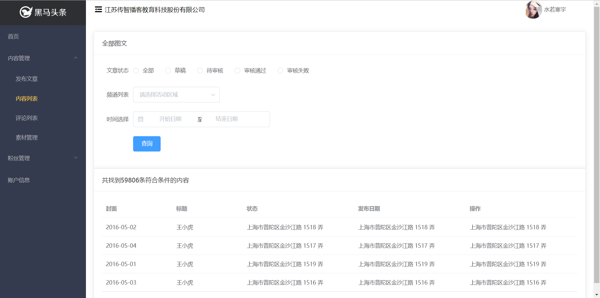

# 五、文章列表模块

## 页面准备



```html
<template>
  <div class="article">
    <!-- 筛选数据 -->
    <el-card class="box-card">
      <div slot="header" class="clearfix">
        <span>全部图文</span>
      </div>
      <el-form ref="form" label-width="80px">
        <el-form-item label="文章状态">
          <el-radio-group v-model="filterForm.status">
            <el-radio label="全部"></el-radio>
            <el-radio label="草稿"></el-radio>
            <el-radio label="待审核"></el-radio>
            <el-radio label="审核通过"></el-radio>
            <el-radio label="审核失败"></el-radio>
          </el-radio-group>
        </el-form-item>
        <el-form-item label="频道列表">
          <el-select placeholder="请选择活动区域" v-model="filterForm.channel_id">
            <el-option label="区域一" value="shanghai"></el-option>
            <el-option label="区域二" value="beijing"></el-option>
          </el-select>
        </el-form-item>
        <el-form-item label="时间选择">
          <el-date-picker
            v-model="rangeDate"
            type="daterange"
            range-separator="至"
            start-placeholder="开始日期"
            end-placeholder="结束日期">
          </el-date-picker>
        </el-form-item>
        <el-form-item>
          <el-button type="primary">查询</el-button>
        </el-form-item>
      </el-form>
    </el-card>
    <!-- /筛选数据 -->

    <!-- 文章列表 -->
    <el-card class="box-card">
      <div slot="header" class="clearfix">
        <span>共找到59806条符合条件的内容</span>
      </div>
      <el-table
        :data="tableData"
        style="width: 100%">
        <el-table-column
          prop="date"
          label="封面"
          width="180">
        </el-table-column>
        <el-table-column
          prop="name"
          label="标题"
          width="180">
        </el-table-column>
        <el-table-column
          prop="address"
          label="状态">
        </el-table-column>
        <el-table-column
          prop="address"
          label="发布日期">
        </el-table-column>
        <el-table-column
          prop="address"
          label="操作">
        </el-table-column>
      </el-table>
    </el-card>
    <!-- /文章列表 -->
  </div>
</template>

<script>
export default {
  name: '',
  data () {
    return {
      // 过滤数据的表单
      filterForm: {
        status: '',
        channel_id: '',
        begin_pubdate: '',
        end_pubdate: ''
      },
      rangeDate: '',
      tableData: [{
        date: '2016-05-02',
        name: '王小虎',
        address: '上海市普陀区金沙江路 1518 弄'
      }, {
        date: '2016-05-04',
        name: '王小虎',
        address: '上海市普陀区金沙江路 1517 弄'
      }, {
        date: '2016-05-01',
        name: '王小虎',
        address: '上海市普陀区金沙江路 1519 弄'
      }, {
        date: '2016-05-03',
        name: '王小虎',
        address: '上海市普陀区金沙江路 1516 弄'
      }]
    }
  }
}
</script>

<style scoped>
</style>

```


## 展示所有文章


1、请求获取文章列表数据

```js
export default {
  // 建议给每个组件都起一个名字，有一些好处，例如我们可以在调试工具中根据名字搜索组件
  name: 'article',
  data () {
    return {
      // 过滤数据的表单
      filterForm: {
        status: '',
        channel_id: '',
        begin_pubdate: '',
        end_pubdate: ''
      },
      rangeDate: '',
+      articles: [], // 文章数据列表
    }
  },

+  created () {
+    this.loadArticles()
+  },

  methods: {
+++    loadArticles () {
      // 在我们的项目中，除了 /login 接口不需要 token，其它所有的接口都需要提供 token 才能请求
      // 否则后端返回 401 错误
      // 我们这里的后端要求把 token 放到请求头中
      const token = window.localStorage.getItem('user-token')

      this.$axios({
        method: 'GET',
        url: '/articles',
        headers: { // 添加请求头
          // 名字: 值
          // 后端要求把 token 放到请求头中，使用一个名字叫：Authorization
          // 注意，token的格式要求：Bearer 用户token
          // 注意！！！Bearer有个空格，多了少了都不行
          Authorization: `Bearer ${token}`
        }
      }).then(res => {
        this.articles = res.data.data.results
      }).catch(err => {
        console.log(err, '获取数据失败')
      })
    }
  }
}
```

2、把数据绑定到模板中

```html
<template>
  <div class="article">
    <!-- 筛选数据 -->
    <el-card class="box-card">
      <div slot="header" class="clearfix">
        <span>全部图文</span>
      </div>
      <el-form ref="form" label-width="80px">
        <el-form-item label="文章状态">
          <el-radio-group v-model="filterForm.status">
            <el-radio label="全部"></el-radio>
            <el-radio label="草稿"></el-radio>
            <el-radio label="待审核"></el-radio>
            <el-radio label="审核通过"></el-radio>
            <el-radio label="审核失败"></el-radio>
          </el-radio-group>
        </el-form-item>
        <el-form-item label="频道列表">
          <el-select placeholder="请选择活动区域" v-model="filterForm.channel_id">
            <el-option label="区域一" value="shanghai"></el-option>
            <el-option label="区域二" value="beijing"></el-option>
          </el-select>
        </el-form-item>
        <el-form-item label="时间选择">
          <el-date-picker
            v-model="rangeDate"
            type="daterange"
            range-separator="至"
            start-placeholder="开始日期"
            end-placeholder="结束日期">
          </el-date-picker>
        </el-form-item>
        <el-form-item>
          <el-button type="primary">查询</el-button>
        </el-form-item>
      </el-form>
    </el-card>
    <!-- /筛选数据 -->

    <!-- 文章列表 -->
    <el-card class="box-card">
      <div slot="header" class="clearfix">
        <span>共找到59806条符合条件的内容</span>
      </div>
      <!--
        el-table 表格组件
        data 表格的数组，要求是数组
        表格组件会使用 data 数据，在内部自己进行遍历，我们不需要自己写什么 v-for
        你只需要告诉这个表格组件：
          data 是啥
          表头名是什么
          列值是什么
        el-table-column 表格列组件
          prop 用来指定渲染哪个数据字段
          label 表头名称
          width 列宽

        表格列默认只能渲染普通文本，如果想要渲染点儿别的东西，需要自定义表格列。
       -->
      <el-table
        :data="articles"
        style="width: 100%">
        <el-table-column
          prop="date"
          label="封面"
          width="180">
          <!--
            自定义表格列
            在 template 上声明 slot-scope="scope" ，然后就可以通过 scope.row 获取遍历项
            scope.row 就相当于我们自己 v-for 的 item

            注意：只有当你需要在自定义表格列模板中访问遍历项的时候才这么做
           -->
          <template slot-scope="scope">
            
          </template>
        </el-table-column>
        <el-table-column
          prop="title"
          label="标题"
          width="180">
        </el-table-column>
        <el-table-column
          prop="status"
          label="状态">
          <template slot-scope="scope">
            <el-tag
              :type="articleStatus[scope.row.status].type"
            >{{ articleStatus[scope.row.status].label }}</el-tag>
          </template>
        </el-table-column>
        <el-table-column
          prop="pubdate"
          label="发布日期">
        </el-table-column>
        <el-table-column
          prop="address"
          label="操作">
          <template>
            <el-button type="danger" size="mini">删除</el-button>
            <el-button type="primary" size="mini">编辑</el-button>
          </template>
        </el-table-column>
      </el-table>
    </el-card>
    <!-- /文章列表 -->
  </div>
</template>
```


## 数据分页

## 数据筛选

## 删除文章

### 解决后端返回数据中数字超出 JS 安全整数范围问题

程序中的数据 id 和服务端返回的原始数据 id 不一致，原因是该数字 id 超出了 JavaScript 的安全整数范围，无法精确表示，会出现偏差。
JavaScript 最大能表示的安全整数范围是：`Number.MAX_SAFE_INTEGER` ，也就是 `9007199254740991
` ，1125650609278550016 肯定是超出了 9007199254740991，JavaScript 无法安全表示。

这里我们可以使用一个第三方包 [json-biginit](https://github.com/sidorares/json-bigint) 来解决这个问题。具体方式就是：

安装：

```bash
npm i json-bigint
在main.js中引入包
// 引入json-bigint包
import JSONbig from 'json-bigint'
```

配置 axios 手动解析后端返回的 JSON 格式数据：

```js
// axios 解析完的对象中的数字已经有问题了。
// 对于这种问题，axios 给你提供了一个 API，可以手动解析原始数据。
// 我们就可以在 axios 提供的那个 API 中使用 json-biginit 去解析含有超出安全整数范围的 json 内容数据。
// 它会将 json 转为 JavaScript 对象，它自动判断内容中数字如果超出安全整数范围，自动处理成其他格式
// JSONbig.parse(json);
在main.js中写：
axios.defaults.transformResponse = [function (data) {
  // 这里使用 JSONbig.parse 转换原始数据
  // 类似于 JSON.parse
  // 但是它会处理其中超出安全整数范围的整数问题。
  // 严谨一点，如果 data 不是 json 格式字符串就会报错
  try {
    // 如果是 json 格式字符串，那就转换并返回给后续使用
    return JSONbig.parse(data)
  } catch (err) {
    // 报错就意味着 data 不是 json 格式字符串，这里就直接原样返回给后续使用
    return data
  }
}]
```

使用的时候将数据中的 `id.toString()` 即可，当然如果它和字符串拼接会自动 toString()。

### 删除操作

- 注册点击事件，传递要删除的文章id
- 在删除处理函数中，请求执行删除操作
