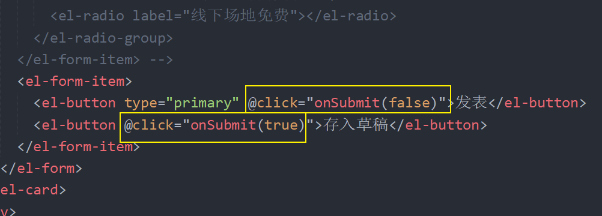
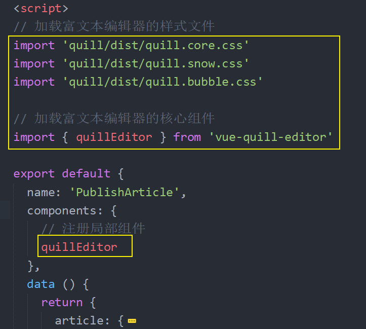
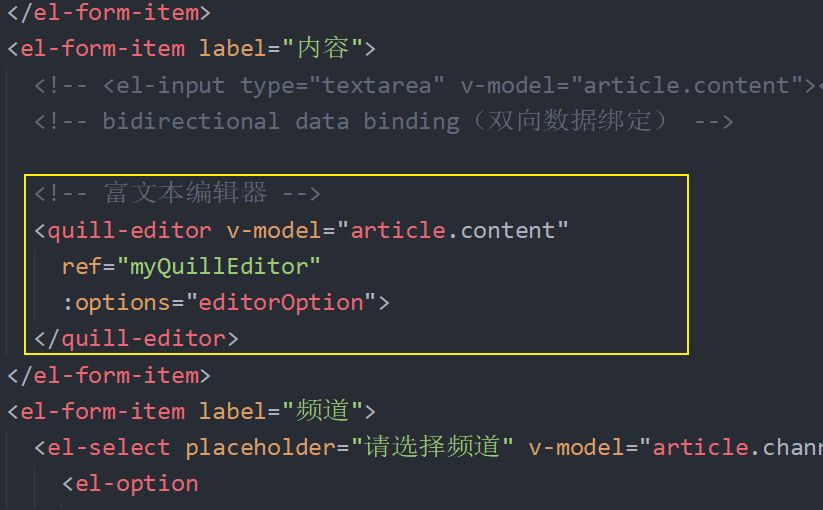
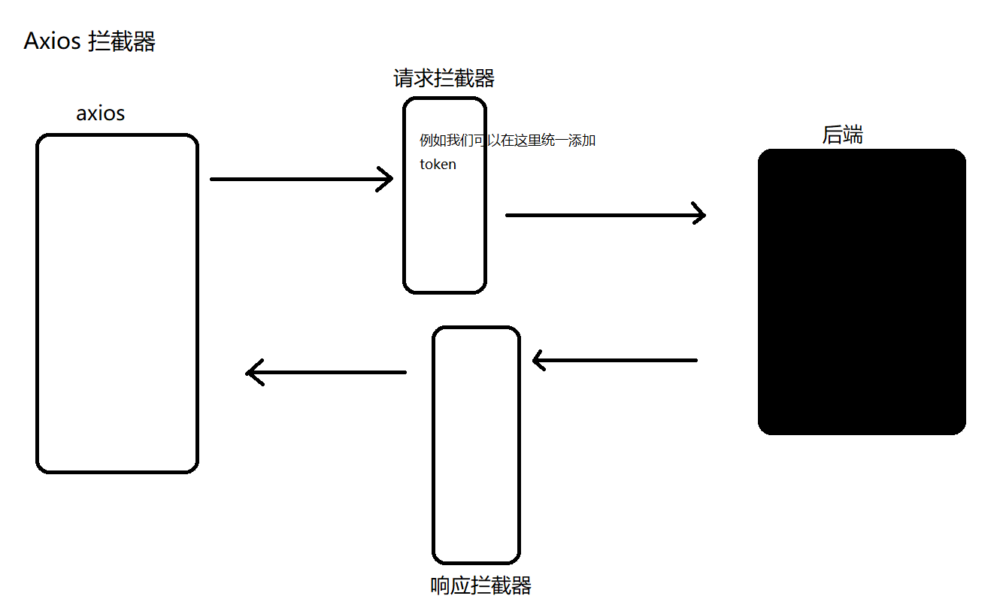

# 六、文章发布

## 准备

```html
<template>
  <div class="publish">
    <el-card class="box-card">
      <div slot="header" class="clearfix">
        <span>发布文章</span>
      </div>
      <el-form ref="form" :model="article" label-width="80px">
        <el-form-item label="标题">
          <el-input v-model="article.title"></el-input>
        </el-form-item>
        <el-form-item label="内容">
          <el-input type="textarea" v-model="article.content"></el-input>
        </el-form-item>
        <el-form-item label="频道">
          <el-select v-model="article.channel_id" placeholder="请选择活动区域">
            <el-option label="区域一" value="shanghai"></el-option>
            <el-option label="区域二" value="beijing"></el-option>
          </el-select>
        </el-form-item>
        <!-- <el-form-item label="封面">
          <el-radio-group v-model="form.resource">
            <el-radio label="线上品牌商赞助"></el-radio>
            <el-radio label="线下场地免费"></el-radio>
          </el-radio-group>
        </el-form-item> -->
        <el-form-item>
          <el-button type="primary" @click="onSubmit">发表</el-button>
          <el-button>存入草稿</el-button>
        </el-form-item>
      </el-form>
    </el-card>
  </div>
</template>

<script>
export default {
  name: 'PublishArticle',
  data () {
    return {
      article: {
        title: '', // 文章标题
        content: '', // 文章内容
        cover: {
          type: 0, // 封面类型 -1:自动，0-无图，1-1张，3-3张
          images: [] // 图片，无图就是空数组即可
        },
        channel_id: ''
      }
    }
  },

  methods: {
    onSubmit () {
      console.log('submit!')
    }
  }
}
</script>

<style scoped>
</style>

```

## 处理频道选择

```html
<template>
  <div class="publish">
    <el-card class="box-card">
      <div slot="header" class="clearfix">
        <span>发布文章</span>
      </div>
      <el-form ref="form" :model="article" label-width="80px">
        <el-form-item label="标题">
          <el-input v-model="article.title"></el-input>
        </el-form-item>
        <el-form-item label="内容">
          <el-input type="textarea" v-model="article.content"></el-input>
        </el-form-item>
        <el-form-item label="频道">
          <el-select placeholder="请选择频道" v-model="article.channel_id">
            <el-option
              :label="channel.name"
              :value="channel.id"
              v-for="channel in channels"
              :key="channel.id"
            ></el-option>
          </el-select>
        </el-form-item>
        <!-- <el-form-item label="封面">
          <el-radio-group v-model="form.resource">
            <el-radio label="线上品牌商赞助"></el-radio>
            <el-radio label="线下场地免费"></el-radio>
          </el-radio-group>
        </el-form-item> -->
        <el-form-item>
          <el-button type="primary" @click="onSubmit">发表</el-button>
          <el-button>存入草稿</el-button>
        </el-form-item>
      </el-form>
    </el-card>
  </div>
</template>

<script>
export default {
  name: 'PublishArticle',
  data () {
    return {
      article: {
        title: '', // 文章标题
        content: '', // 文章内容
        cover: {
          type: 0, // 封面类型 -1:自动，0-无图，1-1张，3-3张
          images: [] // 图片，无图就是空数组即可
        },
        channel_id: ''
      },
      channels: []
    }
  },

  created () {
    this.loadChannels()
  },

  methods: {
    onSubmit () {
      console.log('submit!')
    },

    loadChannels () {
      // 有些接口需要 token，有些接口不需要 token
      // 是否需要，应该由接口文档指示
      this.$axios({
        method: 'GET',
        url: '/channels'
      }).then(res => {
        this.channels = res.data.data.channels
      }).catch(err => {
        console.log(err, '获取数据失败')
      })
    }
  }
}
</script>

<style scoped>
</style>

```


## 文章发布

1、给发布和存入草稿按钮注册点击事件



2、在处理函数中

```js
onSubmit (draft) {
  this.$axios({
    method: 'POST',
    url: '/articles',
    // Headers 参数
    headers: {
      Authorization: `Bearer ${window.localStorage.getItem('user-token')}`
    },
    // Query 参数
    params: {
      draft
    },
    // Body 参数
    data: this.article
  }).then(res => {
    console.log(res)
  }).catch(err => {
    console.log(err, '保存失败')
  })
},
```


## 使用富文本编辑器

基于 Vue 的富文本编辑器有很多，例如官方就收录推荐了一些： https://github.com/vuejs/awesome-vue#rich-text-editing 。

我们这里以使用  [vue-quill-editor](https://github.com/surmon-china/vue-quill-editor) 为例。

1、安装

```bash
# yarn add vue-quill-editor
# npm 在版本5以前需要加 --save，版本5以后默认就是 --save，所以写不写这个 --save 无所谓了
# --save 的简写是 -S，两者是一个意思
npm install vue-quill-editor --save
```

2、将富文本编辑器组件注册到局部



3、在文本内容的模板位置使用富文本编辑器



最后，回到浏览器编辑测试。

## 优化：统一添加 token

每次发送请求手动的往 headers 中添加 token 太麻烦，我们可以使用 axios 的拦截器统一处理。



axios 提供了两种拦截器：

- 请求拦截器
- 响应拦截器

在 `main.js` 中使用 axios 的请求拦截器统一添加 token：

```js
// axios 请求拦截器
axios.interceptors.request.use(function (config) {
  // 在请求拦截器函数中的 config 是本次请求相关的配置对象
  // config 就是最后要发给后端的那个配置对象
  // 我们可以在拦截器中对 config 进行统一配置定制
  console.log('请求拦截器', config)

  const token = window.localStorage.getItem('user-token')

  // 统一添加 token
  if (token) {
    config.headers.Authorization = `Bearer ${token}`
  }

  // return config 是通行的规则
  return config
}, function (error) {
  // Do something with request error
  return Promise.reject(error)
})
```

然后把其它所有请求中的 headers 中的 token 移除进行测试。

## 文章封面

## 编辑文章

## 提取 ChannelSelect 业务组件
