# 五、文章列表模块

## 页面准备

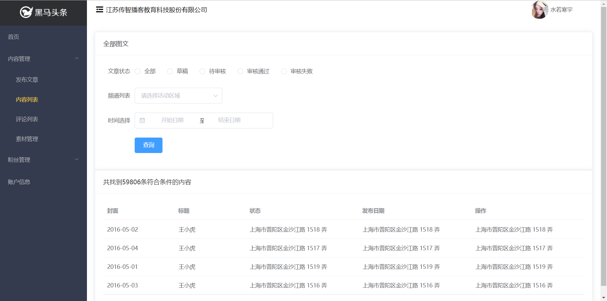

```html
<template>
  <div class="article">
    <!-- 筛选数据 -->
    <el-card class="box-card">
      <div slot="header" class="clearfix">
        <span>全部图文</span>
      </div>
      <el-form ref="form" label-width="80px">
        <el-form-item label="文章状态">
          <el-radio-group v-model="filterForm.status">
            <el-radio label="全部"></el-radio>
            <el-radio label="草稿"></el-radio>
            <el-radio label="待审核"></el-radio>
            <el-radio label="审核通过"></el-radio>
            <el-radio label="审核失败"></el-radio>
          </el-radio-group>
        </el-form-item>
        <el-form-item label="频道列表">
          <el-select placeholder="请选择活动区域" v-model="filterForm.channel_id">
            <el-option label="区域一" value="shanghai"></el-option>
            <el-option label="区域二" value="beijing"></el-option>
          </el-select>
        </el-form-item>
        <el-form-item label="时间选择">
          <el-date-picker
            v-model="rangeDate"
            type="daterange"
            range-separator="至"
            start-placeholder="开始日期"
            end-placeholder="结束日期">
          </el-date-picker>
        </el-form-item>
        <el-form-item>
          <el-button type="primary">查询</el-button>
        </el-form-item>
      </el-form>
    </el-card>
    <!-- /筛选数据 -->

    <!-- 文章列表 -->
    <el-card class="box-card">
      <div slot="header" class="clearfix">
        <span>共找到59806条符合条件的内容</span>
      </div>
      <el-table
        :data="tableData"
        style="width: 100%">
        <el-table-column
          prop="date"
          label="封面"
          width="180">
        </el-table-column>
        <el-table-column
          prop="name"
          label="标题"
          width="180">
        </el-table-column>
        <el-table-column
          prop="address"
          label="状态">
        </el-table-column>
        <el-table-column
          prop="address"
          label="发布日期">
        </el-table-column>
        <el-table-column
          prop="address"
          label="操作">
        </el-table-column>
      </el-table>
    </el-card>
    <!-- /文章列表 -->
  </div>
</template>

<script>
export default {
  name: '',
  data () {
    return {
      // 过滤数据的表单
      filterForm: {
        status: '',
        channel_id: '',
        begin_pubdate: '',
        end_pubdate: ''
      },
      rangeDate: '',
      tableData: [{
        date: '2016-05-02',
        name: '王小虎',
        address: '上海市普陀区金沙江路 1518 弄'
      }, {
        date: '2016-05-04',
        name: '王小虎',
        address: '上海市普陀区金沙江路 1517 弄'
      }, {
        date: '2016-05-01',
        name: '王小虎',
        address: '上海市普陀区金沙江路 1519 弄'
      }, {
        date: '2016-05-03',
        name: '王小虎',
        address: '上海市普陀区金沙江路 1516 弄'
      }]
    }
  }
}
</script>

<style scoped>
</style>

```


## 展示所有文章

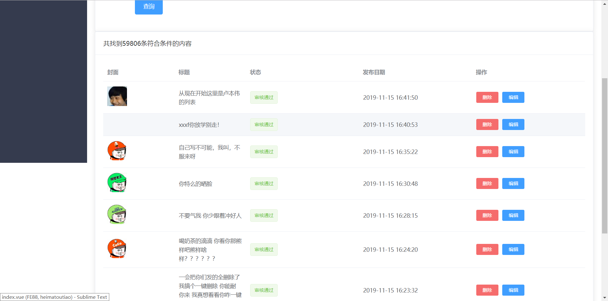

1、请求获取文章列表数据

```js
export default {
  // 建议给每个组件都起一个名字，有一些好处，例如我们可以在调试工具中根据名字搜索组件
  name: 'article',
  data () {
    return {
      // 过滤数据的表单
      filterForm: {
        status: '',
        channel_id: '',
        begin_pubdate: '',
        end_pubdate: ''
      },
      rangeDate: '',
+      articles: [], // 文章数据列表
    }
  },

+  created () {
+    this.loadArticles()
+  },

  methods: {
+++    loadArticles () {
      // 在我们的项目中，除了 /login 接口不需要 token，其它所有的接口都需要提供 token 才能请求
      // 否则后端返回 401 错误
      // 我们这里的后端要求把 token 放到请求头中
      const token = window.localStorage.getItem('user-token')

      this.$axios({
        method: 'GET',
        url: '/articles',
        // 添加请求头
        // 请求头也是给后端提交参数的一种形式
        headers: {
          // 名字: 值
          // 后端要求把 token 放到请求头中，使用一个名字叫：Authorization
          // 注意，token的格式要求：Bearer 用户token
          // 注意！！！Bearer后面有个空格，多了少了都不行
          Authorization: `Bearer ${token}`
        }
      }).then(res => {
        this.articles = res.data.data.results
      }).catch(err => {
        console.log(err, '获取数据失败')
      })
    }
  }
}
```

2、把数据绑定到模板中

```html
<template>
  <div class="article">
    <!-- 筛选数据 -->
    <el-card class="box-card">
      <div slot="header" class="clearfix">
        <span>全部图文</span>
      </div>
      <el-form ref="form" label-width="80px">
        <el-form-item label="文章状态">
          <el-radio-group v-model="filterForm.status">
            <el-radio label="全部"></el-radio>
            <el-radio label="草稿"></el-radio>
            <el-radio label="待审核"></el-radio>
            <el-radio label="审核通过"></el-radio>
            <el-radio label="审核失败"></el-radio>
          </el-radio-group>
        </el-form-item>
        <el-form-item label="频道列表">
          <el-select placeholder="请选择活动区域" v-model="filterForm.channel_id">
            <el-option label="区域一" value="shanghai"></el-option>
            <el-option label="区域二" value="beijing"></el-option>
          </el-select>
        </el-form-item>
        <el-form-item label="时间选择">
          <el-date-picker
            v-model="rangeDate"
            type="daterange"
            range-separator="至"
            start-placeholder="开始日期"
            end-placeholder="结束日期">
          </el-date-picker>
        </el-form-item>
        <el-form-item>
          <el-button type="primary">查询</el-button>
        </el-form-item>
      </el-form>
    </el-card>
    <!-- /筛选数据 -->

    <!-- 文章列表 -->
    <el-card class="box-card">
      <div slot="header" class="clearfix">
        <span>共找到59806条符合条件的内容</span>
      </div>
      <!--
        el-table 表格组件
        data 表格的数组，要求是数组
        表格组件会使用 data 数据，在内部自己进行遍历，我们不需要自己写什么 v-for
        你只需要告诉这个表格组件：
          data 是啥
          表头名是什么
          列值是什么
        el-table-column 表格列组件
          prop 用来指定渲染哪个数据字段
          label 表头名称
          width 列宽

        表格列默认只能渲染普通文本，如果想要渲染点儿别的东西，需要自定义表格列。
       -->
      <el-table
        :data="articles"
        style="width: 100%">
        <el-table-column
          prop="date"
          label="封面"
          width="180">
          <!--
            自定义表格列
            在 template 上声明 slot-scope="scope" ，然后就可以通过 scope.row 获取遍历项
            scope.row 就相当于我们自己 v-for 的 item

            注意：只有当你需要在自定义表格列模板中访问遍历项的时候才这么做
           -->
          <template slot-scope="scope">
            
          </template>
        </el-table-column>
        <el-table-column
          prop="title"
          label="标题"
          width="180">
        </el-table-column>
        <el-table-column
          prop="status"
          label="状态">
          <template slot-scope="scope">
            <el-tag
              :type="articleStatus[scope.row.status].type"
            >{{ articleStatus[scope.row.status].label }}</el-tag>
          </template>
        </el-table-column>
        <el-table-column
          prop="pubdate"
          label="发布日期">
        </el-table-column>
        <el-table-column
          prop="address"
          label="操作">
          <template>
            <el-button type="danger" size="mini">删除</el-button>
            <el-button type="primary" size="mini">编辑</el-button>
          </template>
        </el-table-column>
      </el-table>
    </el-card>
    <!-- /文章列表 -->
  </div>
</template>
```


## 数据分页

1、将获取文章列表的 `loadArticles` 方法稍加修改，增加一个 `page` 参数

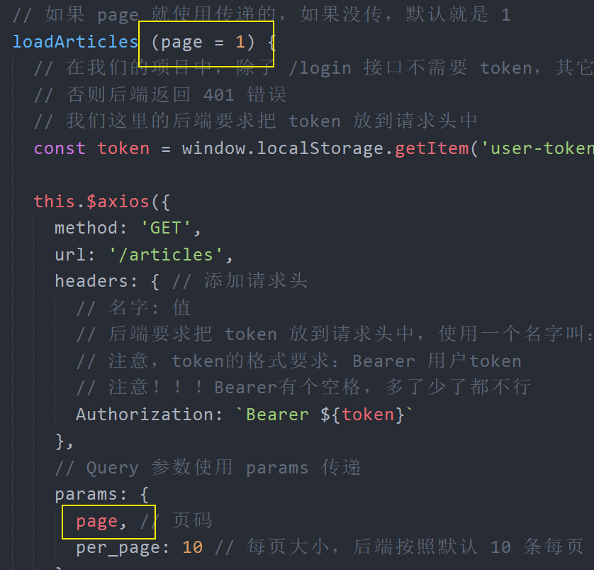

2、在 data 中添加数据 `total` 用来记录总数据条数

```js
data () {
  return {
    ...
    totalCount: 0,
  }
}
```

3、在文章列表下面添加分页组件模板

```html
<!-- 分页 -->
<!--
  分页组件：
  它默认按照 10 条每页划分页码
  total 用来指定一共有多少条数据
  background 背景色
  layout 用来控制布局
 -->
<el-pagination
  background
  layout="prev, pager, next"
  :total="totalCount"
  @current-change="onPageChange">
</el-pagination>
<!-- /分页 -->
```


4、在 methods 中添加 `onPageChange` 方法

```js
/**
 * 页码改变的时候会调用这个函数
 */
onPageChange (page) {
  this.loadArticles(page)
}
```


## Loading 效果

两个需求：

- 表格数据加载中的 loading 效果
- 加载过程禁用分页组件


下面是具体实现方式：

1、在 data 中添加 `loading` 数据

2、在文章列表表格上使用 `v-loading` 指令绑定 `loading` 数据

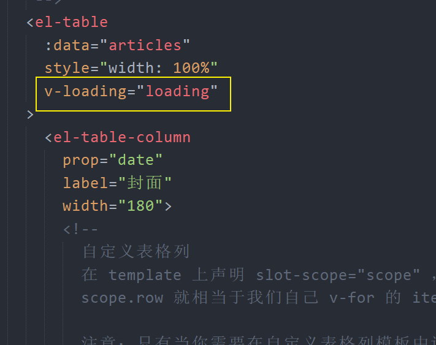

3、在分页组件上绑定 `loging` 控制它的禁用状态

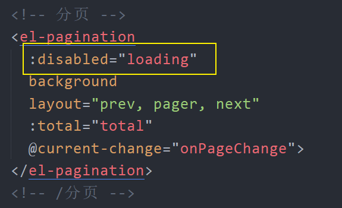

4、在获取文章数据的请求方法中

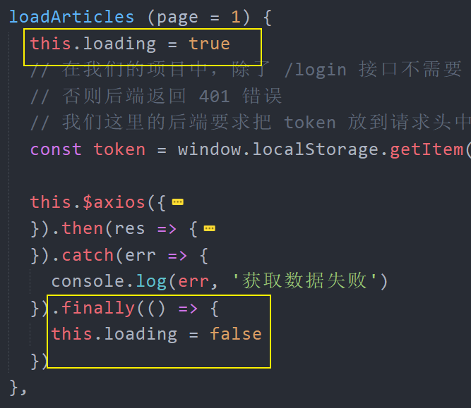

> 无论成功还是失败最终都要执行 finally 。

## 数据筛选

把视图处理成接口需要的数据提交给后端。

### 筛选状态

1、处理绑定表单中文章状态的单选框组

```html
<el-radio-group v-model="filterForm.status">
            <!-- 接口要求，不传为全部 -->
            <el-radio :label="null">全部</el-radio>
            <el-radio label="0">草稿</el-radio>
            <el-radio label="1">待审核</el-radio>
            <el-radio label="2">审核通过</el-radio>
            <el-radio label="3">审核失败</el-radio>
            <el-radio label="4">已删除</el-radio>
          </el-radio-group>
```

2、在请求获取文章列表的 `loadArticles` 函数中

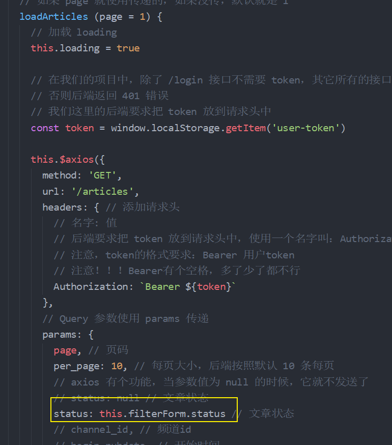

> 一个知识点：axios 不会发送值为 null、undefined 类型的参数。

3、点击查询的时候，调用 `loadArticles` 方法

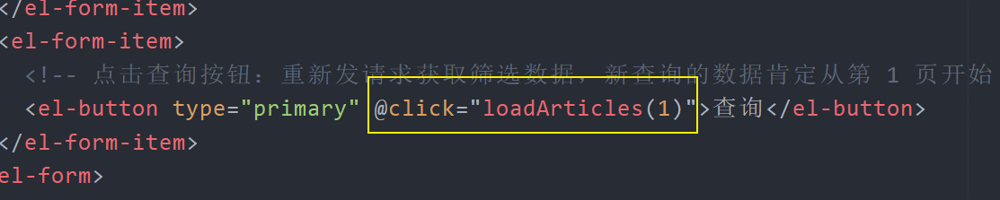

### 筛选频道

一、在下拉列表中展示频道列表

1、在 data 中添加数据字段用来存储频道列表

```js
data () {
  return {
    ...
    channels: []
  }
}
```


2、发请求加载频道列表

```js
loadChannels () {
  // 有些接口需要 token，有些接口不需要 token
  // 是否需要，应该由接口文档指示
  this.$axios({
    method: 'GET',
    url: '/channels'
  }).then(res => {
    this.channels = res.data.data.channels
  }).catch(err => {
    console.log(err, '获取数据失败')
  })
}
```


3、模板绑定

```html
<el-form-item label="频道列表">
  <!--
    下拉列表会把选中的 option 的 value 同步到数据中
   -->
  <el-select placeholder="请选择频道" v-model="filterForm.channel_id">
    <el-option
      :label="channel.name"
      :value="channel.id"
      v-for="channel in channels"
      :key="channel.id"
    ></el-option>
  </el-select>
</el-form-item>
```


二、结合筛选

1、将绑定文章id的数据字段初始化为 `null`

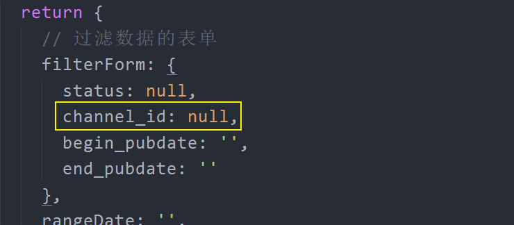

2、将数据绑定到频道下拉列表中

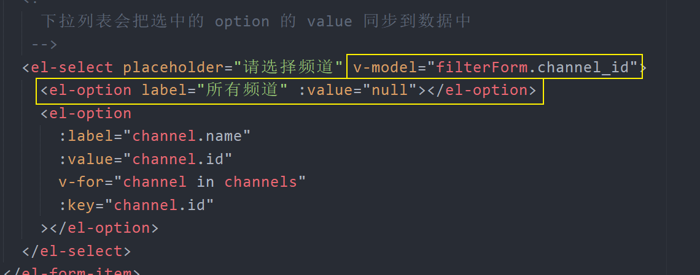

3、在 `loadArticles` 中传递频道id

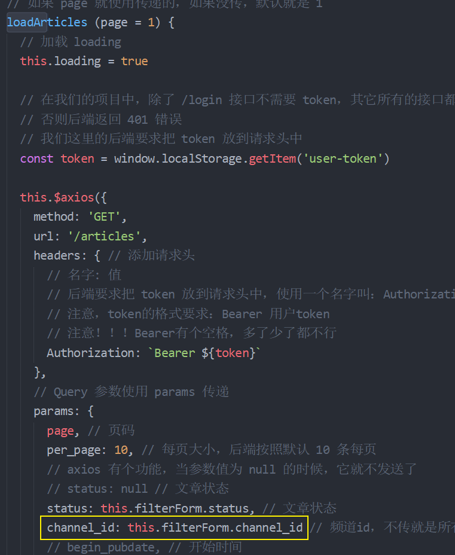


### 筛选时间

1、在 data 中添加数据用于绑定日期选择器

```js
data () {
	return {
    ...
    rangeDate: []
  }
}
```

2、将数据绑定到日期选择器上

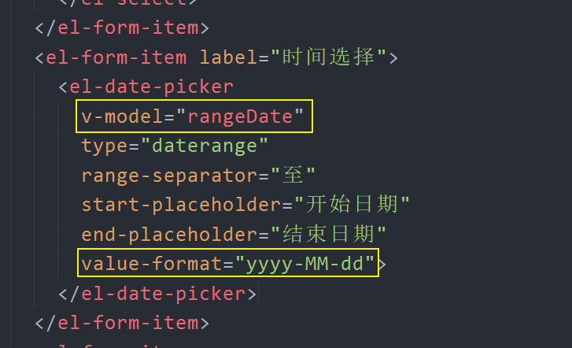

> value-format， 可选，绑定值的格式。不指定则绑定值为 Date 对象 
>
> 具体格式详见： [日期格式](https://element.eleme.cn/#/zh-CN/component/date-picker#ri-qi-ge-shi)

3、在 `loadArticles` 中传递日期参数

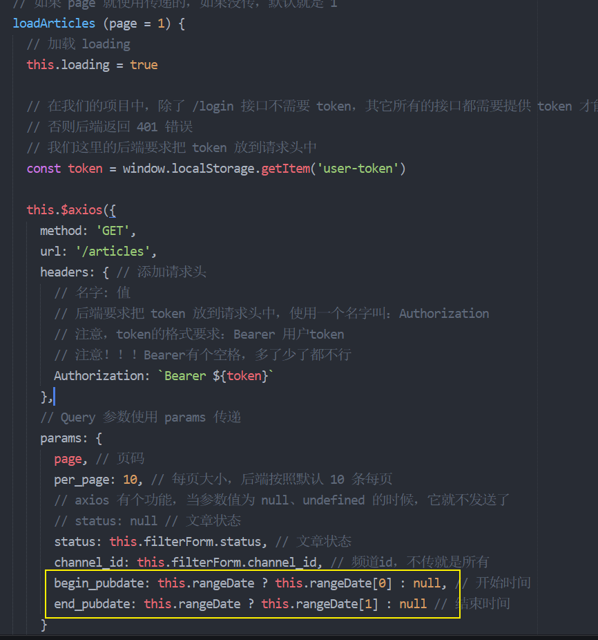

> 这里手动判断数据是否有效主要是因为当用户手动清除日期的时候，数据被重置为 null 了，如果数据为  null，那你 `null[下标]` 就报错了，所以这里要手动校验一下。

## 删除文章

### 解决后端返回数据中数字超出 JS 安全整数范围问题

- 后端返回的都是字符串
- axios 请求会自动把字符串转为 JavaScript 对象
- 在转换的过程中，大数字丢失了精度

解法：使用 json-biginit 转换。

程序中的数据 id 和服务端返回的原始数据 id 不一致，原因是该数字 id 超出了 JavaScript 的安全整数范围，无法精确表示，会出现偏差。
JavaScript 最大能表示的安全整数范围是：`Number.MAX_SAFE_INTEGER` ，也就是 `9007199254740991
` ，1125650609278550016 肯定是超出了 9007199254740991，JavaScript 无法安全表示。

这里我们可以使用一个第三方包 [json-biginit](https://github.com/sidorares/json-bigint) 来解决这个问题。具体方式就是：

1、安装

```bash
npm i json-bigint
```

2、在 `main.js` 中配置 axios 自定义后端数据转换规则

```js
...
import JSONbig from 'json-bigint'

axios.defaults.transformResponse = [function (data, headers) {
  // Do whatever you want to transform the data

  // axios 默认使用 JSON.parse(data)
  // 我们这里手动配置使用 JSONbig.parse(data)
  try {
    return JSONbig.parse(data)
  } catch (err) {
    console.log(err)
    // 一旦 try 里面的代码执行引发异常，那么就进入 catch 执行
    return {}
  }
}]
```

使用的时候将数据中的 `数字.toString()` 即可，当然如果它和字符串拼接会自动 toString()。

### 删除操作

- 注册点击事件，传递要删除的文章id
- 在删除处理函数中，请求执行删除操作

1、为删除按钮注册点击事件

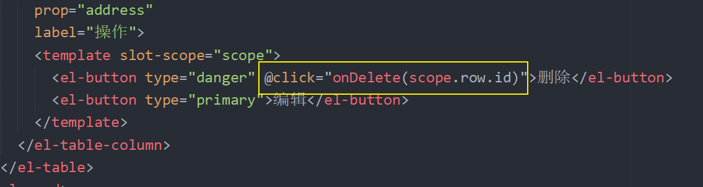

2、记录当前页码

在 data 中添加数据成员 `page` 用来存储当前页码

```js
data () {
  return {
    ...
    page: 0
  }
}
```

然后在页码改变的时候：

```js
onPageChange (page) {
  // 记录当前最新页码
+  this.page = page
  // 请求加载指定页码的文章列表
  this.loadArticles(page)
},
```


3、在处理函数中请求删除文章，删除成功，重载当前页文章列表

```js
onDelete (articleId) {
  // 这里报 400 错，是因为数据 id 的问题
  // 这个数据 id 不对
  this.$axios({
    method: 'DELETE',
    // /mp/v1_0/articles/:target
    // 注意：接口路径中的 :target 是一个路径参数，:target 是动态的，例如1、2、3，不要写 :
    url: `/articles/${articleId}`, // 任何数据和字符串相加都会自动 toString
    headers: {
      // 接口中说明的 Content-Type application/json 不需要传递
      // 因为 axios 会自动添加发送 Content-Type application/json
      Authorization: `Bearer ${window.localStorage.getItem('user-token')}`
    }
  }).then(res => {
    // 删除成功，重新加载当前页码文章列表
    this.loadArticles(this.page)
  }).catch(err => {
    console.log(err, '删除失败')
  })
}
```

