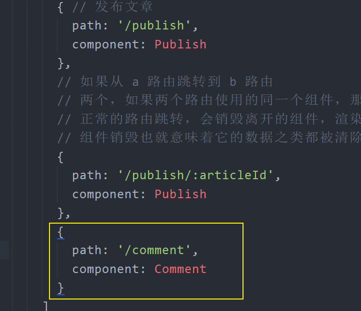
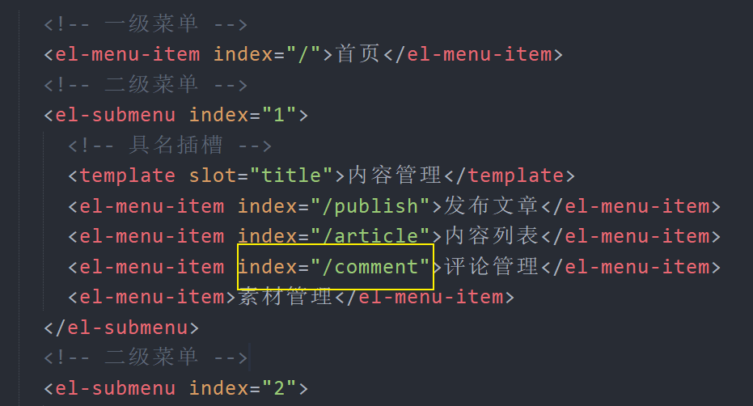
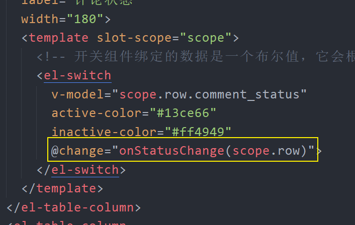

# 七、评论列表

## 准备

### 创建组件并配置路由

1、创建 `src/views/comment/index.vue` 并写入

```html
<template>
  <div>
    评论管理
  </div>
</template>

<script>
export default {
  // 组件的 name 最好起名为两个单词，尽量少用一个单词
  // 为什么？为了避免和原生的 html 标签冲突
  name: 'CommentIndex',
  components: {},
  props: {},
  data () {
    return {
    }
  },
  computed: {},
  watch: {
  },
  created () {
  },
  methods: {
  }
}
</script>

<style scoped></style>

```

2、配置路由表



3、配置侧边栏的导航路径



最后在浏览器中访问测试。

### 布局

```html
<template>
  <div>
    <el-card class="box-card">
      <div slot="header" class="clearfix">
        <span>评论管理</span>
      </div>
      <el-table
        :data="tableData"
        style="width: 100%">
        <el-table-column
          prop="date"
          label="日期"
          width="180">
        </el-table-column>
        <el-table-column
          prop="name"
          label="姓名"
          width="180">
        </el-table-column>
        <el-table-column
          prop="address"
          label="地址">
        </el-table-column>
      </el-table>
    </el-card>
  </div>
</template>

<script>
export default {
  // 组件的 name 最好起名为两个单词，尽量少用一个单词
  // 为什么？为了避免和原生的 html 标签冲突
  name: 'CommentIndex',
  components: {},
  props: {},
  data () {
    return {
      tableData: [{
        date: '2016-05-02',
        name: '王小虎',
        address: '上海市普陀区金沙江路 1518 弄'
      }, {
        date: '2016-05-04',
        name: '王小虎',
        address: '上海市普陀区金沙江路 1517 弄'
      }, {
        date: '2016-05-01',
        name: '王小虎',
        address: '上海市普陀区金沙江路 1519 弄'
      }, {
        date: '2016-05-03',
        name: '王小虎',
        address: '上海市普陀区金沙江路 1516 弄'
      }]
    }
  },
  computed: {},
  watch: {
  },
  created () {
  },
  methods: {
  }
}
</script>

<style scoped></style>

```


## 展示文章评论列表

```html
<template>
  <div>
    <el-card class="box-card">
      <div slot="header" class="clearfix">
        <span>评论管理</span>
      </div>
      <el-table
        :data="articles"
        style="width: 100%">
        <el-table-column
          prop="title"
          label="标题"
          width="180">
        </el-table-column>
        <el-table-column
          prop="total_comment_count"
          label="总评论数">
        </el-table-column>
        <el-table-column
          prop="fans_comment_count"
          label="粉丝评论数据">
        </el-table-column>
        <el-table-column
          label="评论状态"
          width="180">
          <template slot-scope="scope">
            <!-- 开关组件绑定的数据是一个布尔值，它会根据布尔值的真假来决定开关状态 -->
            <el-switch
              v-model="scope.row.comment_status"
              active-color="#13ce66"
              inactive-color="#ff4949">
            </el-switch>
          </template>
        </el-table-column>
        <el-table-column
          label="操作">
          <template>
            <el-button type="primary">修改</el-button>
          </template>
        </el-table-column>
      </el-table>
    </el-card>
  </div>
</template>

<script>
export default {
  // 组件的 name 最好起名为两个单词，尽量少用一个单词
  // 为什么？为了避免和原生的 html 标签冲突
  name: 'CommentIndex',
  components: {},
  props: {},
  data () {
    return {
+      articles: [] // 文章列表（文章的评论数据字段）
    }
  },
  computed: {},
  watch: {
  },
  created () {
+    this.loadArticles()
  },
  methods: {
+++    loadArticles () {
      this.$axios({
        method: 'GET',
        url: '/articles',
        params: {
          response_type: 'comment'
          // page: xxx // 页码
        }
      }).then(res => {
        this.articles = res.data.data.results
      }).catch(err => {
        console.log(err, '获取数据失败')
      })
    }
  }
}
</script>

<style scoped></style>

```


## 修改评论状态

1、给开关组件注册 `change` 事件



2、在事件处理函数请求修改评论状态

```js
onStatusChange (article) {
  this.$axios({
    method: 'PUT',
    url: '/comments/status',
    params: {
      article_id: article.id.toString()
    },
    data: {
      // 开关组件双向绑定了 article.comment_status
      // 所以获取 article.comment_status 也就是在获取开关组件的启用状态
      allow_comment: article.comment_status
    }
  }).then(res => {
    console.log(res)
    this.$message({
      type: 'success',
      message: `${article.comment_status ? '启用' : '关闭'}成功`
    })
  }).catch(err => {
    console.log(err)
    this.$message.error('操作失败')
  })
}
```

## 数据分页

