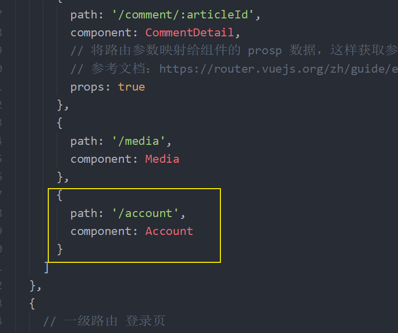
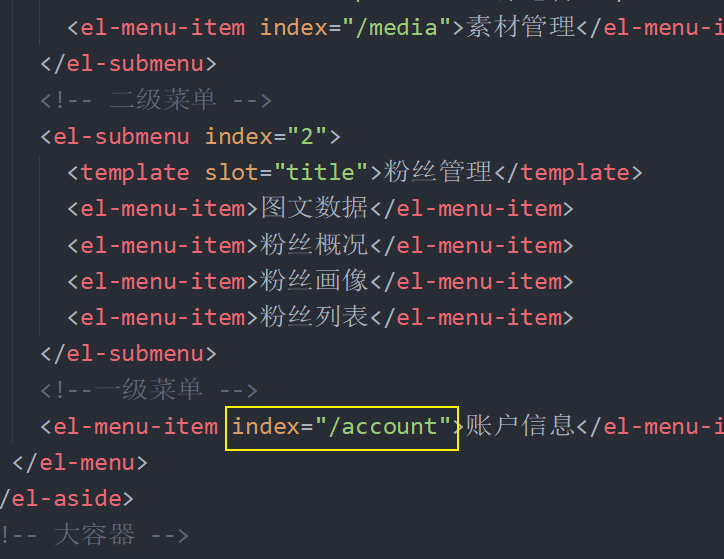

# 九、账户设置

## 准备

1、创建 `src/views/account/index.vue` 组件

```html
<template>
  <div>
    <el-form ref="form" :model="form" label-width="80px">
      <el-form-item label="用户头像">
        <el-upload
          class="avatar-uploader"
          action="https://jsonplaceholder.typicode.com/posts/"
          :show-file-list="false">
          
          <!-- <i class="el-icon-plus avatar-uploader-icon"></i> -->
        </el-upload>
      </el-form-item>
      <el-form-item label="用户昵称">
        <el-input v-model="form.name"></el-input>
      </el-form-item>
      <el-form-item label="个人介绍">
        <el-input type="textarea" v-model="form.name"></el-input>
      </el-form-item>
      <el-form-item label="用户邮箱">
        <el-input v-model="form.name"></el-input>
      </el-form-item>
      <el-form-item>
        <el-button type="primary" @click="onSubmit">保存修改</el-button>
      </el-form-item>
    </el-form>
  </div>
</template>

<script>
export default {
  name: 'AccountIndex',
  components: {},
  props: {},
  data () {
    return {
      form: {
        name: '',
        region: '',
        date1: '',
        date2: '',
        delivery: false,
        type: [],
        resource: '',
        desc: ''
      }
    }
  },
  computed: {},
  watch: {
  },
  created () {},
  methods: {
    onSubmit () {
      console.log('保存')
    }
  }
}
</script>

<style scoped></style>

```

2、配置路由



3、配置侧边栏导航链接




## 展示账户信息

```html
<template>
  <div>
    <el-form ref="form" :model="user" label-width="80px">
      <el-form-item label="用户头像">
        <el-upload
          class="avatar-uploader"
          action="https://jsonplaceholder.typicode.com/posts/"
          :show-file-list="false">
          
          <!-- <i class="el-icon-plus avatar-uploader-icon"></i> -->
        </el-upload>
      </el-form-item>
      <el-form-item label="用户昵称">
        <el-input v-model="user.name"></el-input>
      </el-form-item>
      <el-form-item label="个人介绍">
        <el-input type="textarea" v-model="user.intro"></el-input>
      </el-form-item>
      <el-form-item label="用户邮箱">
        <el-input v-model="user.email"></el-input>
      </el-form-item>
      <el-form-item label="手机号">
        <el-input v-model="user.mobile"></el-input>
      </el-form-item>
      <el-form-item>
        <el-button type="primary" @click="onSubmit">保存修改</el-button>
      </el-form-item>
    </el-form>
  </div>
</template>

<script>
export default {
  name: 'AccountIndex',
  components: {},
  props: {},
  data () {
    return {
+++      user: {
        email: '', // 邮箱
        intro: '', // 简介
        mobile: '', // 手机号
        name: '', // 昵称
        photo: '' // 头像
      }
    }
  },
  computed: {},
  watch: {
  },
  created () {
+    this.loadUserProfile()
  },
  methods: {
    onSubmit () {
      console.log('保存')
    },

+++    loadUserProfile () {
      this.$axios({
        method: 'GET',
        url: '/user/profile'
      }).then(res => {
        // res.date undefined
        // undefined.data 报错了
        this.user = res.data.data
      }).catch(err => {
        console.log(err)
        this.$message.error('获取数据失败')
      })
    }
  }
}
</script>

<style scoped></style>

```


## 修改账户信息

## 账户头像上传

