# 六、文章发布

## 准备

```html
<template>
  <div class="publish">
    <el-card class="box-card">
      <div slot="header" class="clearfix">
        <span>发布文章</span>
      </div>
      <el-form ref="form" :model="article" label-width="80px">
        <el-form-item label="标题">
          <el-input v-model="article.title"></el-input>
        </el-form-item>
        <el-form-item label="内容">
          <el-input type="textarea" v-model="article.content"></el-input>
        </el-form-item>
        <el-form-item label="频道">
          <el-select v-model="article.channel_id" placeholder="请选择活动区域">
            <el-option label="区域一" value="shanghai"></el-option>
            <el-option label="区域二" value="beijing"></el-option>
          </el-select>
        </el-form-item>
        <!-- <el-form-item label="封面">
          <el-radio-group v-model="form.resource">
            <el-radio label="线上品牌商赞助"></el-radio>
            <el-radio label="线下场地免费"></el-radio>
          </el-radio-group>
        </el-form-item> -->
        <el-form-item>
          <el-button type="primary" @click="onSubmit">发表</el-button>
          <el-button>存入草稿</el-button>
        </el-form-item>
      </el-form>
    </el-card>
  </div>
</template>

<script>
export default {
  name: 'PublishArticle',
  data () {
    return {
      article: {
        title: '', // 文章标题
        content: '', // 文章内容
        cover: {
          type: 0, // 封面类型 -1:自动，0-无图，1-1张，3-3张
          images: [] // 图片，无图就是空数组即可
        },
        channel_id: ''
      }
    }
  },

  methods: {
    onSubmit () {
      console.log('submit!')
    }
  }
}
</script>

<style scoped>
</style>

```

## 处理频道选择

```html
<template>
  <div class="publish">
    <el-card class="box-card">
      <div slot="header" class="clearfix">
        <span>发布文章</span>
      </div>
      <el-form ref="form" :model="article" label-width="80px">
        <el-form-item label="标题">
          <el-input v-model="article.title"></el-input>
        </el-form-item>
        <el-form-item label="内容">
          <el-input type="textarea" v-model="article.content"></el-input>
        </el-form-item>
        <el-form-item label="频道">
          <el-select placeholder="请选择频道" v-model="article.channel_id">
            <el-option
              :label="channel.name"
              :value="channel.id"
              v-for="channel in channels"
              :key="channel.id"
            ></el-option>
          </el-select>
        </el-form-item>
        <!-- <el-form-item label="封面">
          <el-radio-group v-model="form.resource">
            <el-radio label="线上品牌商赞助"></el-radio>
            <el-radio label="线下场地免费"></el-radio>
          </el-radio-group>
        </el-form-item> -->
        <el-form-item>
          <el-button type="primary" @click="onSubmit">发表</el-button>
          <el-button>存入草稿</el-button>
        </el-form-item>
      </el-form>
    </el-card>
  </div>
</template>

<script>
export default {
  name: 'PublishArticle',
  data () {
    return {
      article: {
        title: '', // 文章标题
        content: '', // 文章内容
        cover: {
          type: 0, // 封面类型 -1:自动，0-无图，1-1张，3-3张
          images: [] // 图片，无图就是空数组即可
        },
        channel_id: ''
      },
      channels: []
    }
  },

  created () {
    this.loadChannels()
  },

  methods: {
    onSubmit () {
      console.log('submit!')
    },

    loadChannels () {
      // 有些接口需要 token，有些接口不需要 token
      // 是否需要，应该由接口文档指示
      this.$axios({
        method: 'GET',
        url: '/channels'
      }).then(res => {
        this.channels = res.data.data.channels
      }).catch(err => {
        console.log(err, '获取数据失败')
      })
    }
  }
}
</script>

<style scoped>
</style>

```


## 文章发布

1、给发布和存入草稿按钮注册点击事件

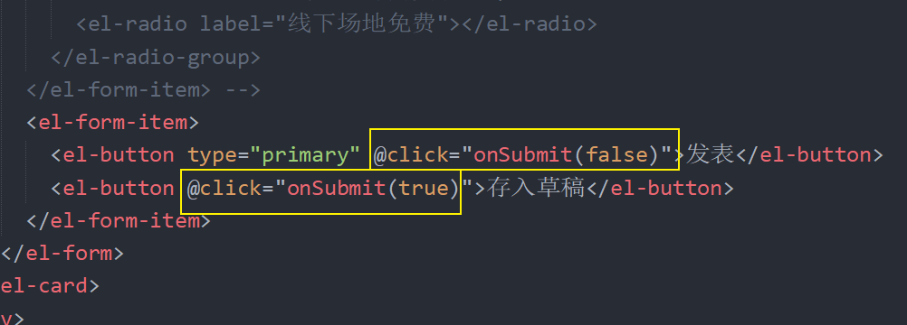

2、在处理函数中

```js
onSubmit (draft) {
  this.$axios({
    method: 'POST',
    url: '/articles',
    // Headers 参数
    headers: {
      Authorization: `Bearer ${window.localStorage.getItem('user-token')}`
    },
    // Query 参数
    params: {
      draft
    },
    // Body 参数
    data: this.article
  }).then(res => {
    console.log(res)
  }).catch(err => {
    console.log(err, '保存失败')
  })
},
```


## 使用富文本编辑器

基于 Vue 的富文本编辑器有很多，例如官方就收录推荐了一些： https://github.com/vuejs/awesome-vue#rich-text-editing 。

我们这里以使用  [vue-quill-editor](https://github.com/surmon-china/vue-quill-editor) 为例。

1、安装

```bash
# yarn add vue-quill-editor
# npm 在版本5以前需要加 --save，版本5以后默认就是 --save，所以写不写这个 --save 无所谓了
# --save 的简写是 -S，两者是一个意思
npm install vue-quill-editor --save
```

2、将富文本编辑器组件注册到局部

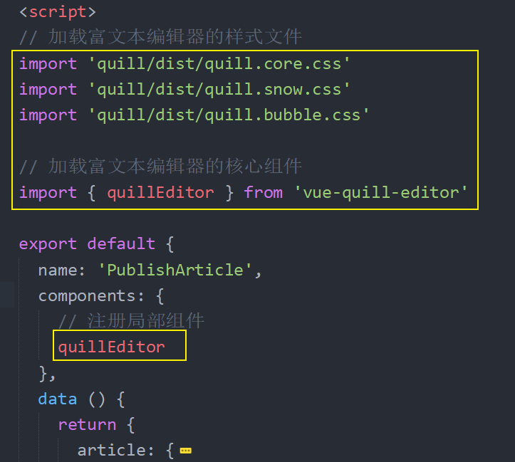

3、在文本内容的模板位置使用富文本编辑器

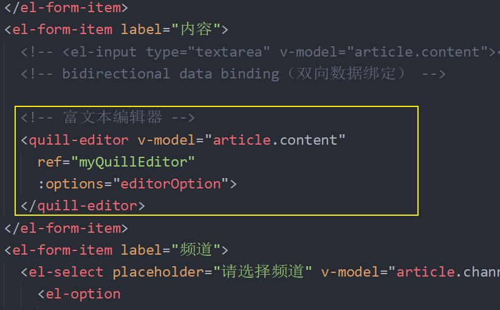

最后，回到浏览器编辑测试。

## 优化：统一添加 token

每次发送请求手动的往 headers 中添加 token 太麻烦，我们可以使用 axios 的拦截器统一处理。


axios 提供了两种拦截器：

- 请求拦截器
- 响应拦截器

在 `main.js` 中使用 axios 的请求拦截器统一添加 token：

```js
// axios 请求拦截器
axios.interceptors.request.use(function (config) {
  // 在请求拦截器函数中的 config 是本次请求相关的配置对象
  // config 就是最后要发给后端的那个配置对象
  // 我们可以在拦截器中对 config 进行统一配置定制
  console.log('请求拦截器', config)

  const token = window.localStorage.getItem('user-token')

  // 统一添加 token
  if (token) {
    config.headers.Authorization = `Bearer ${token}`
  }

  // return config 是通行的规则
  return config
}, function (error) {
  // Do something with request error
  return Promise.reject(error)
})
```

然后把其它所有请求中的 headers 中的 token 移除进行测试。

## 封装频道列表

### 知识补充

参见下发资料中的 `1-代码` 中的 `组件通信.zip`。

### 封装

一、封装数据

```html
<template>
  <div class="channel-select">

    <!--
      element 的下拉列表组件
      它这个组件要求 v-model 绑定数据
    -->
    <el-select placeholder="请选择频道">
      <el-option
        :label="channel.name"
        :value="channel.id"
        v-for="channel in channels"
        :key="channel.id"
      ></el-option>
    </el-select>
  </div>
</template>

<script>
export default {
  name: 'ChannelSelect',
  components: {},
  props: {},
  data () {
    return {
      channels: [] // 存储频道列表
    }
  },
  computed: {},
  watch: {
  },
  created () {
    this.loadChannels()
  },
  methods: {
    loadChannels () {
      // 有些接口需要 token，有些接口不需要 token
      // 是否需要，应该由接口文档指示
      this.$axios({
        method: 'GET',
        url: '/channels'
      }).then(res => {
        this.channels = res.data.data.channels
      }).catch(err => {
        console.log(err, '获取数据失败')
      })
    }
  }
}
</script>

<style scoped></style>

```


二、处理 `v-model` 数据绑定

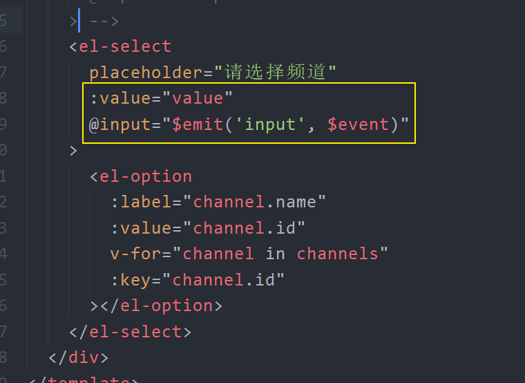

## 文章封面

> 该业务功能比较复杂，需要自定义封装组件，所以放到项目最后讲解。

1、创建 `src/views/publish/components/upload-image.vue` 组件并写入

```html
<template>
  <div>上传图片组件</div>
</template>

<script>
export default {
  name: 'UploadImage',
  components: {},
  props: {},
  data () {
    return {}
  },
  computed: {},
  watch: {
  },
  created () {},
  methods: {}
}
</script>

<style scoped></style>

```

2、在文章发布中加载使用

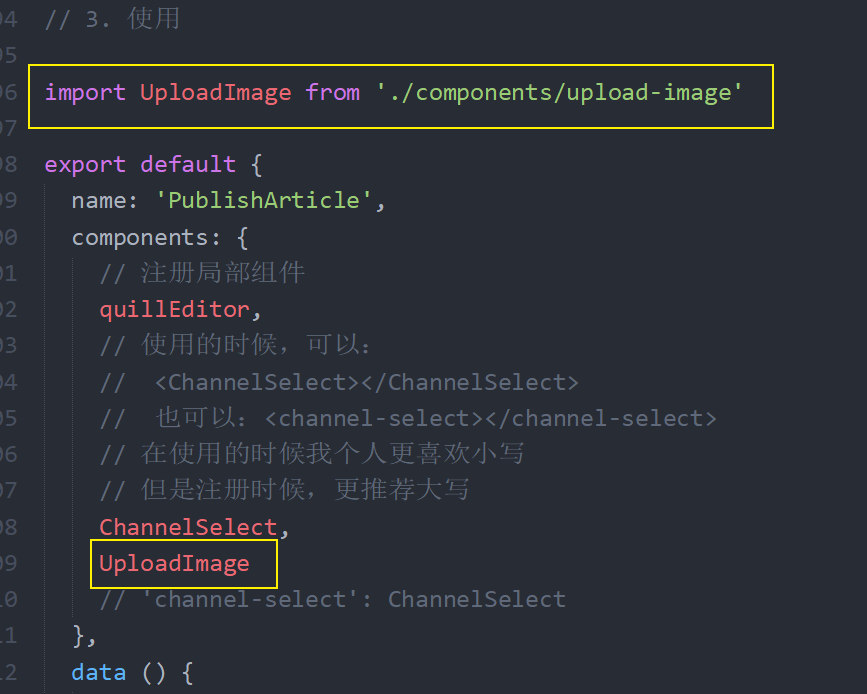

> 注册

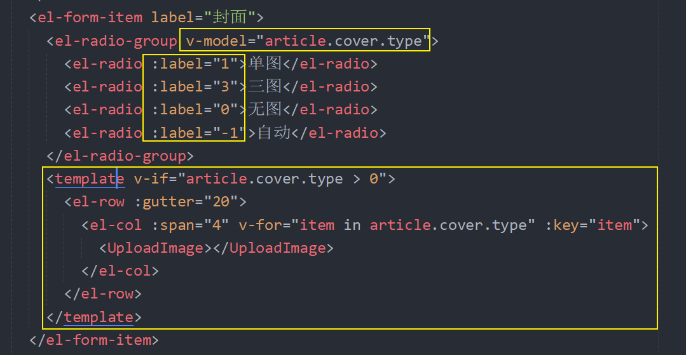

> 在模板中使用

### 使用对话框

```html
<template>
  <div class="upload-image">
    <div class="preview" @click="centerDialogVisible=true">
      <!--  -->
      <i class="el-icon-plus avatar-uploader-icon"></i>
    </div>
    <!--
      visible 控制对话框的显示和隐藏
     -->
    <el-dialog
      title="请选择文章封面图片"
      :visible.sync="centerDialogVisible"
      width="30%"
      center>
      <span slot="footer" class="dialog-footer">
        <el-button @click="centerDialogVisible = false">取 消</el-button>
        <el-button type="primary" @click="centerDialogVisible = false">确 定</el-button>
      </span>
    </el-dialog>
  </div>
</template>

<script>
export default {
  name: 'UploadImage',
  components: {},
  props: {},
  data () {
    return {
      centerDialogVisible: false
    }
  },
  computed: {},
  watch: {
  },
  created () {},
  methods: {}
}
</script>

<style scoped>
.upload-image {
  border: 1px dashed #d9d9d9;
  border-radius: 6px;
  cursor: pointer;
  position: relative;
  overflow: hidden;
}

.upload-image .el-upload:hover {
  border-color: #409EFF;
}

.avatar-uploader-icon {
  font-size: 28px;
  color: #8c939d;
  width: 178px;
  height: 178px;
  line-height: 178px;
  text-align: center;
}

.avatar {
  width: 178px;
  height: 178px;
  display: block;
}
</style>

```

### 展示素材库

```html
<template>
  <div class="upload-image">
    <div class="preview" @click="onUploadShow">
      <!--  -->
      <i class="el-icon-plus avatar-uploader-icon"></i>
    </div>
    <!--
      visible 控制对话框的显示和隐藏
     -->
    <el-dialog
      title="请选择文章封面图片"
      :visible.sync="centerDialogVisible"
      width="50%"
      center
    >
      <!-- 标签导航 -->
      <!--
        el-tabs 组件
          v-model 双向绑定
            数据驱动视图：当绑定数据发生改变，激活的标签页受影响
            视图影响数据：当标签改变的时候，标签的 name 会同步到数据中
          label 标签的标题
          name 相当于标签的 id
       -->
      <el-tabs v-model="activeName">
        <el-tab-pane label="素材库" name="first">
          <!-- 标签内容写到里面来 -->
          <!--
            radio 有个 change 事件
            当选择的 radio 改变的时候会触发
           -->
          <el-radio-group v-model="activeImage" @change="loadImages">
            <el-radio label="all">全部</el-radio>
            <el-radio label="collect">收藏</el-radio>
          </el-radio-group>
          <el-row :gutter="20">
            <el-col :span="6" v-for="item in images" :key="item.id">
              
            </el-col>
          </el-row>
        </el-tab-pane>
        <el-tab-pane label="上传图片" name="second">配置管理</el-tab-pane>
      </el-tabs>
      <!-- /标签导航 -->
      <span slot="footer" class="dialog-footer">
        <el-button @click="centerDialogVisible = false">取 消</el-button>
        <el-button type="primary" @click="centerDialogVisible = false">确 定</el-button>
      </span>
    </el-dialog>
  </div>
</template>

<script>
export default {
  name: 'UploadImage',
  components: {},
  props: {},
  data () {
    return {
      centerDialogVisible: false, // 对话框的显示状态
      activeName: 'first', // 激活的标签页
      activeImage: 'all', // 激活的图片筛选类型
      images: []
    }
  },
  computed: {},
  watch: {
  },
  created () {
    console.log(123)
  },
  methods: {
    onUploadShow () {
      // 请求加载数据
      this.loadImages()

      // 显示弹窗
      this.centerDialogVisible = true
    },

    loadImages () {
      this.$axios({
        method: 'GET',
        url: '/user/images',
        params: {
          // this.activeImage 双向绑定了 radio 选择框组
          // 所以获取 this.activeImage 也就是在获取选中的那个 radio 的状态
          collect: this.activeImage === 'collect' // 是否获取收藏图片
        }
      }).then(res => {
        this.images = res.data.data.results
      }).catch(err => {
        console.log(err)
      })
    }
  }
}
</script>

<style scoped>
.upload-image {
  border: 1px dashed #d9d9d9;
  border-radius: 6px;
  cursor: pointer;
  position: relative;
  overflow: hidden;
}

.upload-image .el-upload:hover {
  border-color: #409EFF;
}

.avatar-uploader-icon {
  font-size: 28px;
  color: #8c939d;
  width: 178px;
  height: 178px;
  line-height: 178px;
  text-align: center;
}

.avatar {
  width: 178px;
  height: 178px;
  display: block;
}
</style>

```

### 处理选择图片

1、添加一个数据字段用来存储当前点击的图片项的索引

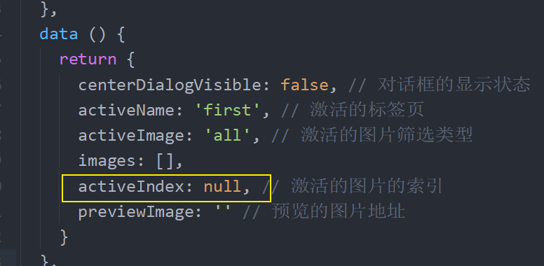

2、模板绑定

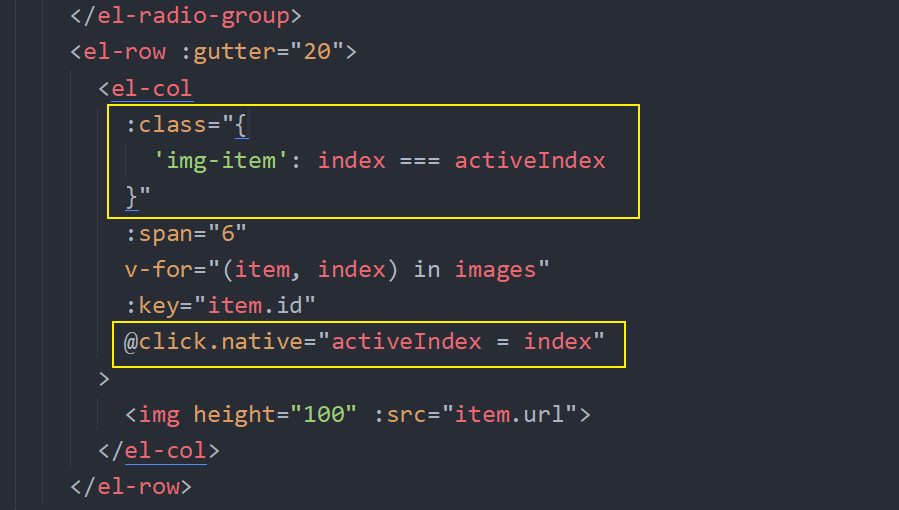

### 数据绑定

1、在父组件中绑定数组元素给图片上传组件

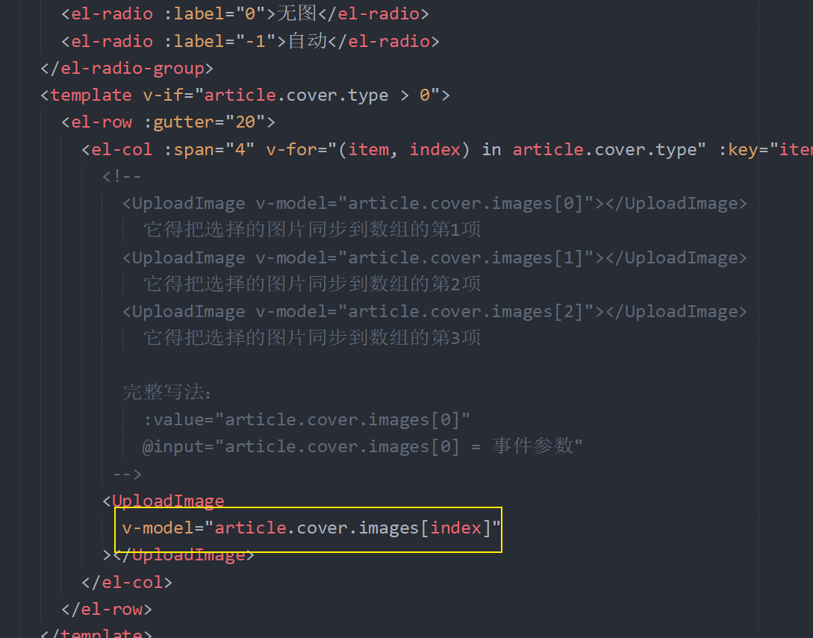

2、在上传图片组件中

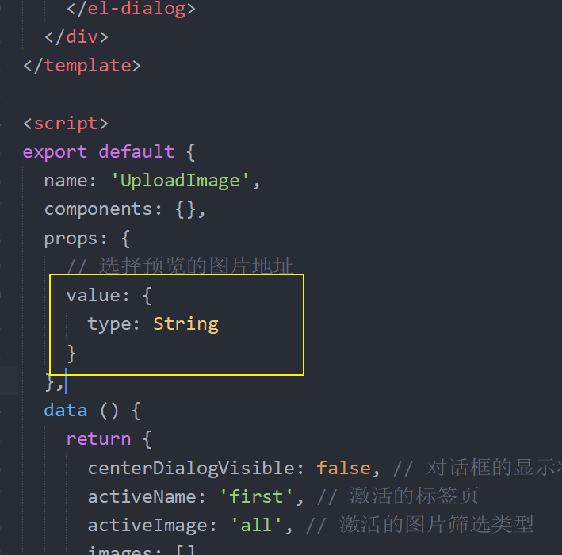

> 声明 value 接收数据

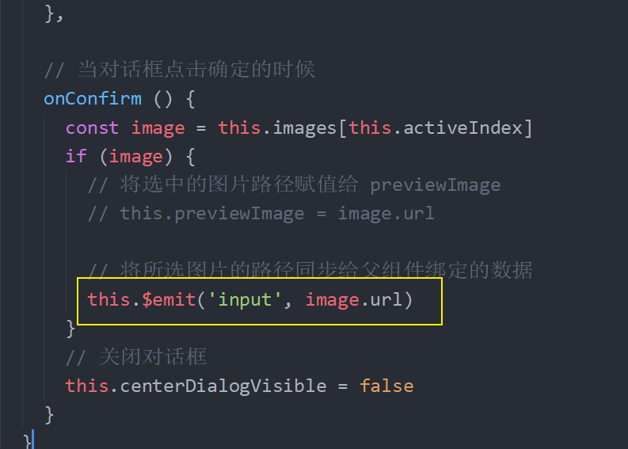

> 点击对话框确认触发：将所选的图片路径发送给父组件

### 上传图片

1、添加上传图片组件

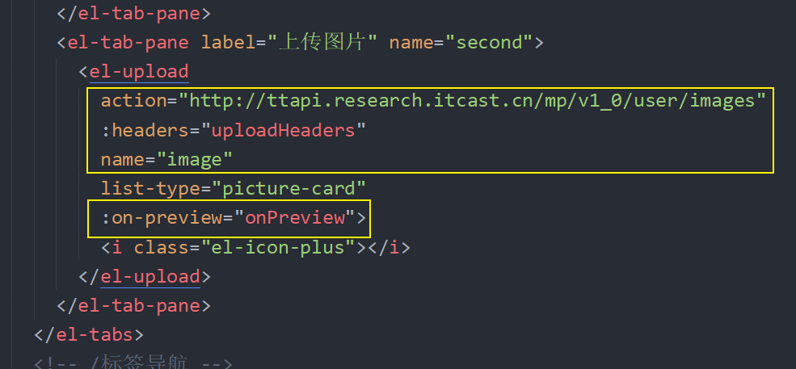

2、记录选择的上传图片

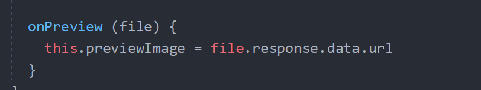

3、对话框确定的时候

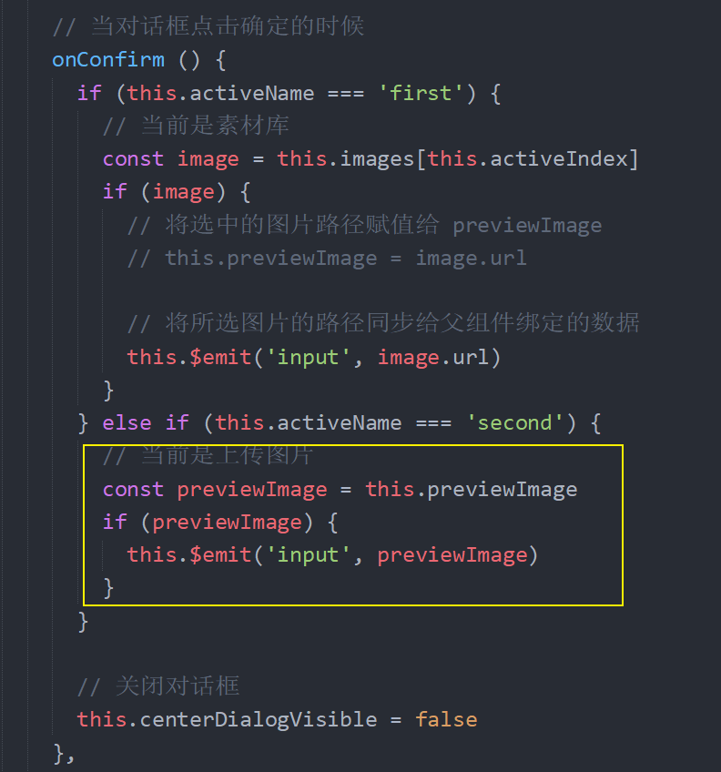

## 编辑文章

### 展示编辑文章

1、将点击编辑的文章id通过路由传递给编辑页面

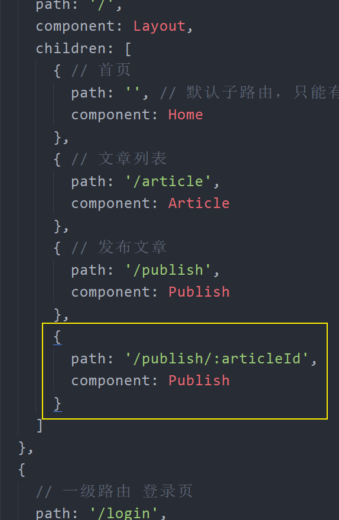

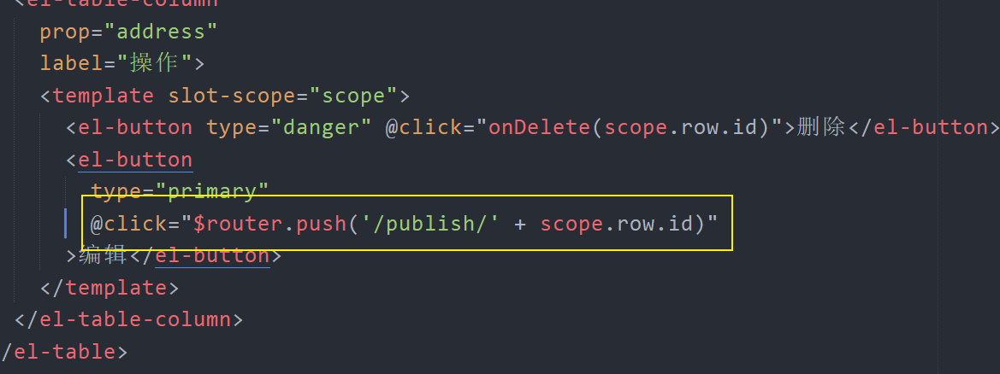

2、然后在组件中初始化加载频道数据

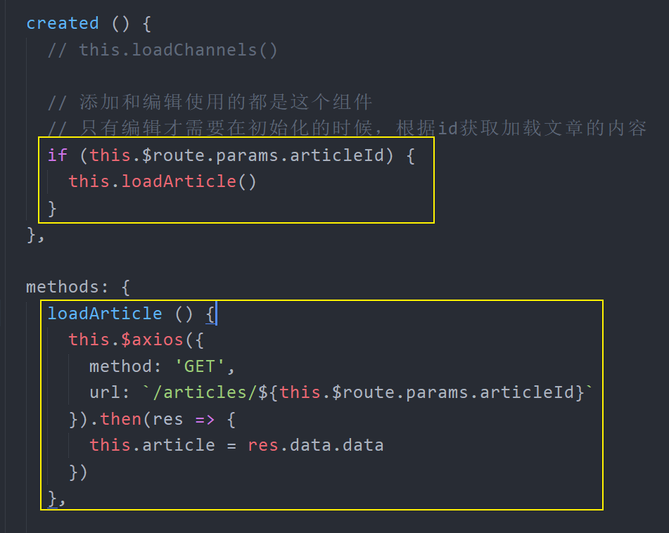

### 提交编辑

```js
onSubmit (draft) {
  if (this.$route.params.articleId) {
    // 请求编辑文章
    this.updateArticle(draft)
  } else {
    // 请求添加文章
    this.addArticle(draft)
  }
},

addArticle (draft) {
  this.$axios({
    method: 'POST',
    url: '/articles',
    // Headers 参数
    // headers: {
    //   Authorization: `Bearer ${window.localStorage.getItem('user-token')}`
    // },
    // Query 参数
    params: {
      draft
    },
    // Body 参数
    data: this.article
  }).then(res => {
    console.log(res)
  }).catch(err => {
    console.log(err, '保存失败')
  })
},

updateArticle (draft) {
  this.$axios({
    method: 'PUT',
    url: `/articles/${this.$route.params.articleId}`,
    params: {
      draft
    },
    data: this.article
  }).then(res => {
    this.$message({
      type: 'success',
      message: '更新成功'
    })
  }).catch(err => {
    console.log(err)
    this.$message.error('更新失败')
  })
}
```

## 禁用路由缓存

我们发现一个小问题，从编辑文章导航到发布文章，表单内容并没有被清空，这是因为两个路由共用的同一个组件，两者之间相互跳转的时候，原来的组件实例会被复用。 因为两个路由都渲染同个组件，比起销毁再创建，复用则显得更加高效。**不过，这也意味着组件的生命周期钩子不会再被调用**。

路由默认提供的这个功能的用意是好的，但是有时候却会带来问题，解决方案就是：**禁用缓存**。

在路由出口 `router-view` 上添加一个唯一的 `key` 即可。

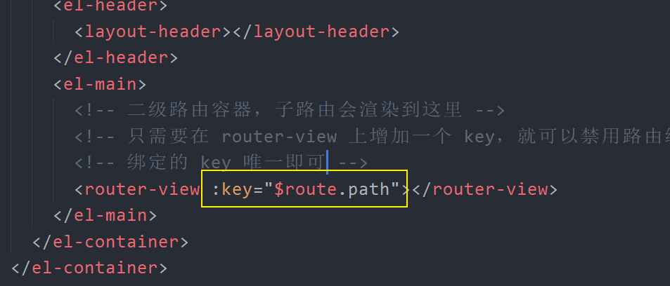

> 详细内容请查阅官方文档：[响应路由参数的变化]( [https://router.vuejs.org/zh/guide/essentials/dynamic-matching.html#%E5%93%8D%E5%BA%94%E8%B7%AF%E7%94%B1%E5%8F%82%E6%95%B0%E7%9A%84%E5%8F%98%E5%8C%96](https://router.vuejs.org/zh/guide/essentials/dynamic-matching.html#响应路由参数的变化) )。