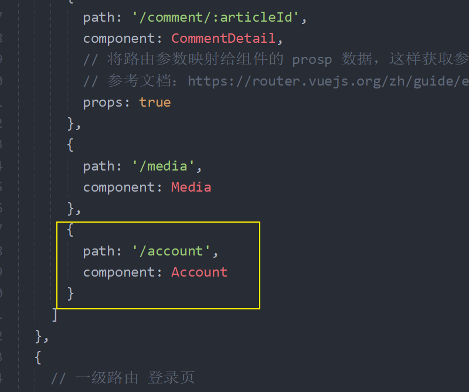
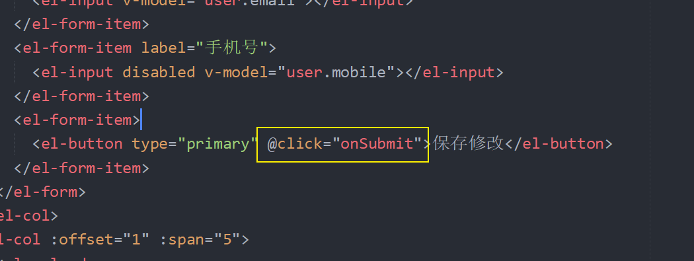
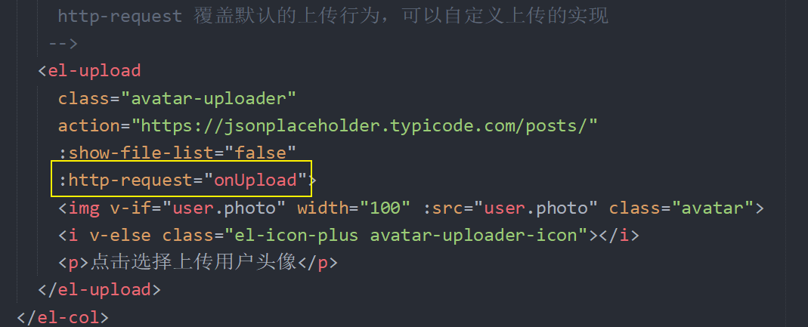
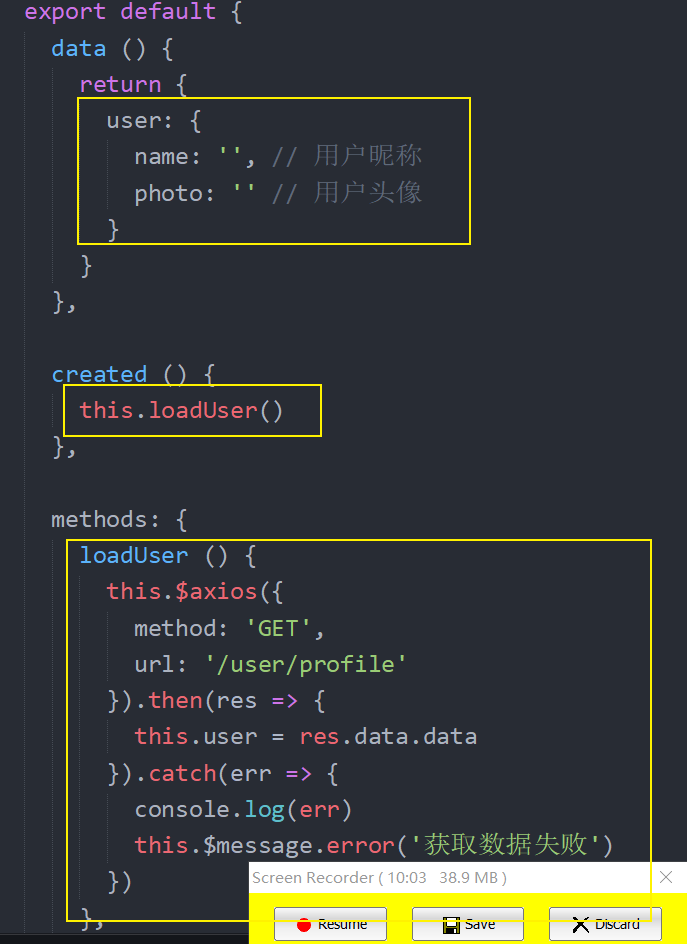
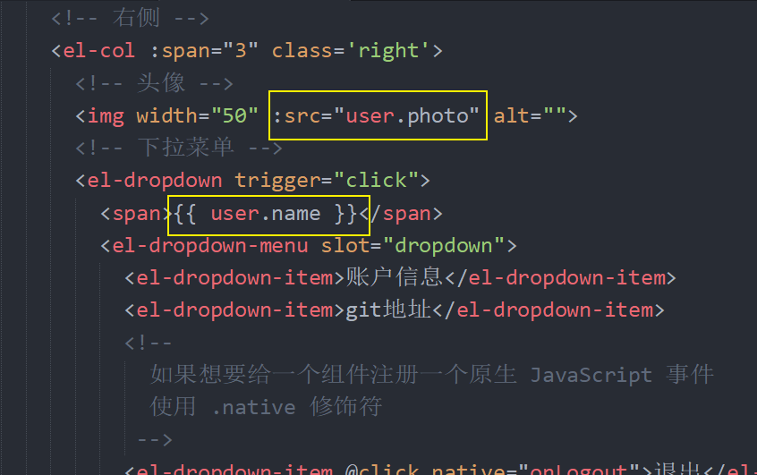
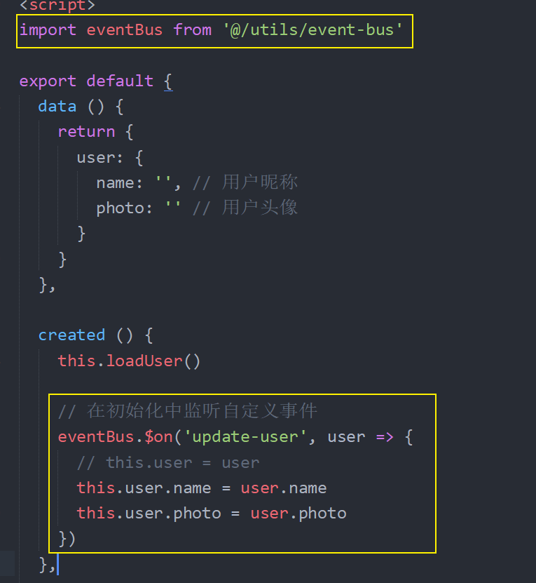
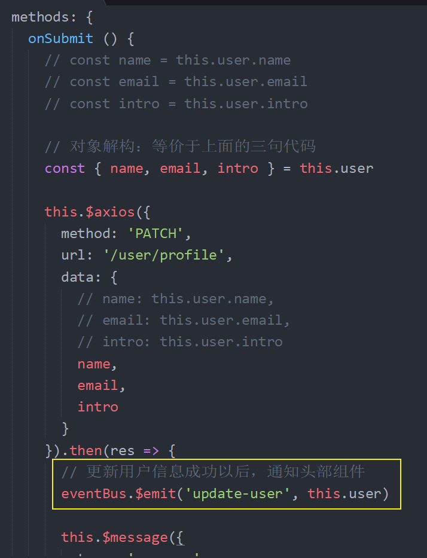
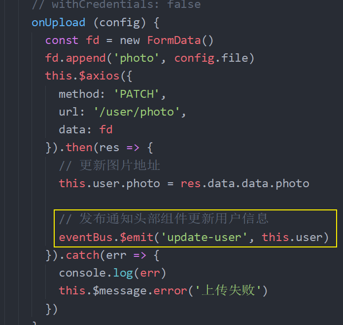

# 九、账户设置

## 准备

1、创建 `src/views/account/index.vue` 组件

```html
<template>
  <div>
    <el-form ref="form" :model="form" label-width="80px">
      <el-form-item label="用户头像">
        <el-upload
          class="avatar-uploader"
          action="https://jsonplaceholder.typicode.com/posts/"
          :show-file-list="false">
          
          <!-- <i class="el-icon-plus avatar-uploader-icon"></i> -->
        </el-upload>
      </el-form-item>
      <el-form-item label="用户昵称">
        <el-input v-model="form.name"></el-input>
      </el-form-item>
      <el-form-item label="个人介绍">
        <el-input type="textarea" v-model="form.name"></el-input>
      </el-form-item>
      <el-form-item label="用户邮箱">
        <el-input v-model="form.name"></el-input>
      </el-form-item>
      <el-form-item>
        <el-button type="primary" @click="onSubmit">保存修改</el-button>
      </el-form-item>
    </el-form>
  </div>
</template>

<script>
export default {
  name: 'AccountIndex',
  components: {},
  props: {},
  data () {
    return {
      form: {
        name: '',
        region: '',
        date1: '',
        date2: '',
        delivery: false,
        type: [],
        resource: '',
        desc: ''
      }
    }
  },
  computed: {},
  watch: {
  },
  created () {},
  methods: {
    onSubmit () {
      console.log('保存')
    }
  }
}
</script>

<style scoped></style>

```

2、配置路由



3、配置侧边栏导航链接


## 展示账户信息

```html
<template>
  <div>
    <el-form ref="form" :model="user" label-width="80px">
      <el-form-item label="用户头像">
        <el-upload
          class="avatar-uploader"
          action="https://jsonplaceholder.typicode.com/posts/"
          :show-file-list="false">
          
          <!-- <i class="el-icon-plus avatar-uploader-icon"></i> -->
        </el-upload>
      </el-form-item>
      <el-form-item label="用户昵称">
        <el-input v-model="user.name"></el-input>
      </el-form-item>
      <el-form-item label="个人介绍">
        <el-input type="textarea" v-model="user.intro"></el-input>
      </el-form-item>
      <el-form-item label="用户邮箱">
        <el-input v-model="user.email"></el-input>
      </el-form-item>
      <el-form-item label="手机号">
        <el-input v-model="user.mobile"></el-input>
      </el-form-item>
      <el-form-item>
        <el-button type="primary" @click="onSubmit">保存修改</el-button>
      </el-form-item>
    </el-form>
  </div>
</template>

<script>
export default {
  name: 'AccountIndex',
  components: {},
  props: {},
  data () {
    return {
+++      user: {
        email: '', // 邮箱
        intro: '', // 简介
        mobile: '', // 手机号
        name: '', // 昵称
        photo: '' // 头像
      }
    }
  },
  computed: {},
  watch: {
  },
  created () {
+    this.loadUserProfile()
  },
  methods: {
    onSubmit () {
      console.log('保存')
    },

+++    loadUserProfile () {
      this.$axios({
        method: 'GET',
        url: '/user/profile'
      }).then(res => {
        // res.date undefined
        // undefined.data 报错了
        this.user = res.data.data
      }).catch(err => {
        console.log(err)
        this.$message.error('获取数据失败')
      })
    }
  }
}
</script>

<style scoped></style>

```


## 修改账户信息

1、注册表单提交



2、在事件处理函数中

```js
onSubmit () {
  // const name = this.user.name
  // const email = this.user.email
  // const intro = this.user.intro

  // 对象解构：等价于上面的三句代码
  const { name, email, intro } = this.user

  this.$axios({
    method: 'PATCH',
    url: '/user/profile',
    data: {
      // name: this.user.name,
      // email: this.user.email,
      // intro: this.user.intro
      name,
      email,
      intro
    }
  }).then(res => {
    this.$message({
      type: 'success',
      message: '修改成功'
    })
  }).catch(err => {
    console.log(err)
    this.$message.error('修改失败')
  })
},
```


## 用户头像上传

由于 element 的 upload 组件不支持自定义请求方法（默认是POST，我们的接口要的是PATCH），所以我们需要自定义上传组件的请求行为：



然后在 `onUpload` 函数中

```js
onUpload (config) {
  const fd = new FormData()
  fd.append('photo', config.file)
  this.$axios({
    method: 'PATCH',
    url: '/user/photo',
    data: fd
  }).then(res => {
    // 更新图片地址
    this.user.photo = res.data.data.photo
  }).catch(err => {
    console.log(err)
    this.$message.error('上传失败')
  })
}
```

## 展示当前登录用户信息

1、请求获取数据



2、数据绑定



## 将修改同步到头部

如何让非父子组件通信？Events Bus。

一、基本语法规则

1、创建 `src/utils/event-bus.js` 并写入

```js
import Vue from 'vue'

// 直接导出一个空的 Vue 实例
export default new Vue()
```

2、使用 `event-bus` 通信

在通信的 a 端初始化 `created` 的时候注册监听一个自定义事件：

```js
import eventBus from '@/utils/event-bus'

export default {
  ...
  created () {
  	// 参数1：一个字符串，自定义事件名称
  	// 参数2：一个函数，事件发布以后就会调用
  	eventBus.$on('自定义事件名称', () => {
      // 业务逻辑代码
    })
    
    // 如果有参数的话，就声明接收
    eventBus.$on('自定义事件名称', (arg) => {
      // 业务逻辑代码
    })
	}
}
```

在通信的 b 端发布调用自定义事件

```js
import eventBus from '@/utils/event-bus'

export default {
  ...
  methods: {
    // 在某个业务方法中
    test () {
      // 参数1：自定义事件名称，必须是订阅的名字一致
      eventBus.$emit('自定义事件名称')
      
      // 如果需要传递额外的数据参数，就从第2个参数开始传
      eventBus.$emit('自定义事件名称', 123)
    }
  }
}
```

注意，通信的双向的：

- a给b发：b来订阅，a来发布
- b给a发：a来订阅，b来发布

另外，同类型的事件可以订阅多次：

```js
eventBus.$on('abc', () => {
  console.log('abc1')
})

eventBus.$on('abc', () => {
  console.log('abc2')
})

eventBus.$on('ddd', () => {
  console.log('ddd')
})

eventBus.$emit('abc') // abc1、abc2

eventBus.$emit('ddd')  // ddd

eventBus.$emit('hello')  // 不会报错，无人响应
```


二：使用 `event-bus` 处理我们的业务

1、在头部组件中使用 event-bus 订阅一个自定义事件，更新用户信息



2、在账户信息组件中，修改成功以后发布通知头部更新数据



> 更新基本信息，发布通知更新



> 更新头像成功，发布通知头部

